% SSI Documentation
% Johannes Wagner
% 03/29/2016

# Introduction {#introduction}

The **Social Signal Interpretation** (SSI) framework offers tools to record, analyse and recognize human behaviour in real-time, such as gestures, mimics, head nods, and emotional speech. Following a patch-based design pipelines are set up from autonomic components and allow the parallel and synchronized processing of sensor data from multiple input devices. The tutorial at hand explains how to set up processing pipelines in XML/C++ and how to develop new components using C++/Python. For reasons of clarity and comprehensibility code snippets will be used throughout the text. The complete source code samples are available as Visual Studio Solution (see 'openssi\\docs\\tutorial\\tutorial.sln'). 

## Key Features {#introduction-keyfeatures}

* Synchronized reading from multiple sensor devices
* General filter and feature algorithms, such as image processing, signal filtering, frequency analysis and statistical measurements in real-time
* Event-based signal processing to combine and interpret high level information, such as gestures, keywords, or emotional user states
* Pattern recognition and machine learning tools for on-line and off-line processing, including various algorithms for feature selection, clustering and classification
* Patch-based pipeline design (C++-API or XML interface) and a plug-in system to integrate new components (C++ or Python)

## Overview {#introduction-overview}

A pipeline in SSI starts from one ore more sensor devices, which in real-time provide a stream of samples in form of small data packages. These streams can be on-the-fly manipulated (*processing*) and mapped onto higher level descriptions (*detection*). Preliminary predictions can be combined into a final decision (*fusion*). To learn models from realistic data, SSI includes a logging mechanism that allows to make synchronized recordings of the connected sensor devices. At run-time raw data information can be shared with external applications through the network.

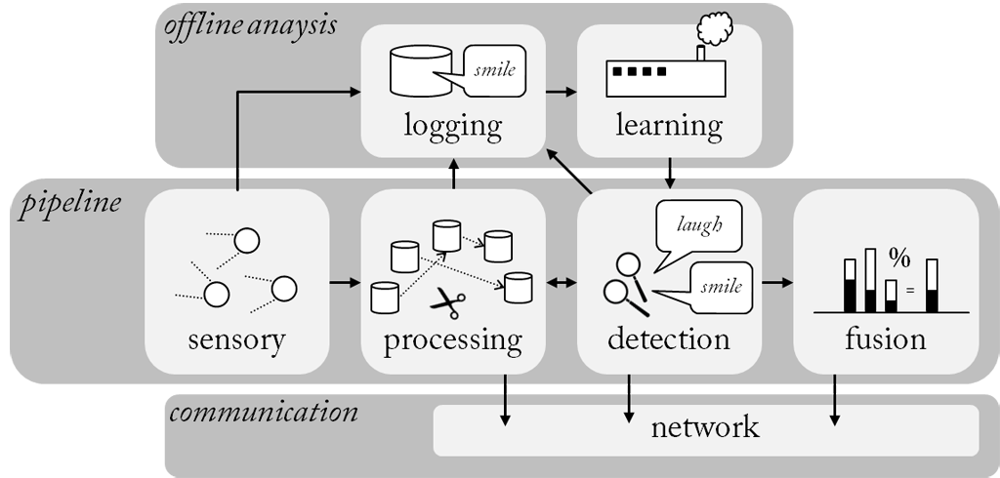{#fig:introduction-overview-0 width=80%}

Since social cues are expressed through a variety of channels, such as face, voice, postures, etc., multiple kind of sensors are required to obtain a complete picture of the interaction. In order to combine information generated by different devices raw signal streams need to be synchronized and handled in a coherent way. Therefore an architecture is established to handle diverse signals in a coherent way, no matter if it is a waveform, a heart beat signal, or a video image.

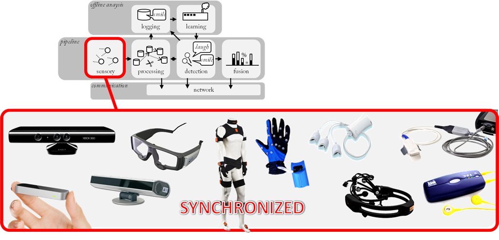{#fig:introduction-overview-1 width=80%}

Sensor devices deliver raw signals, which need to undergo a number of processing steps in order to carve out relevant information and separate it from noisy or irrelevant parts. Therefore, SSI comes with a large repertoire of filter and feature algorithms to treat audiovisual and physiological signals. By putting processing blocks in series developers can quickly build complex processing pipelines, without having to care much about implementation details such as buffering and synchronization, which will be automatically handled by the framework. Since processing blocks are allocated to separate threads, individual window sizes can be chosen for each processing step.

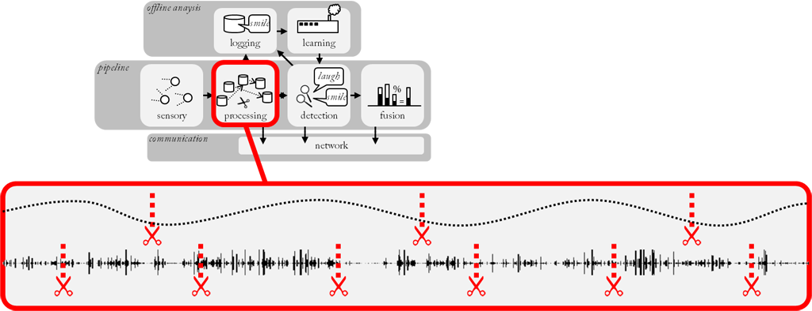{#fig:introduction-overview-2 width=80%}

Since human communication does not follow the precise mechanisms of a machine, but is tainted with a high amount of variability, uncertainty and ambiguity, robust recognizers have to be built that use probabilistic models to recognize and interpret the observed behaviour. To this end, SSI assembles all tasks of a machine learning pipeline including pre-processing, feature extraction, and online classification/fusion in real-time. Feature extraction converts a signal chunk into a set of compact features – keeping only the essential information necessary to classify the observed behaviour. Classification, finally accomplishes a mapping of observed feature vectors onto a set of discrete states or continuous values. Depending on whether the chunks are reduced to a single feature vector or remain a series of variable length, a statistical or dynamic classification scheme is applied. Examples of both types are included in the SSI framework.

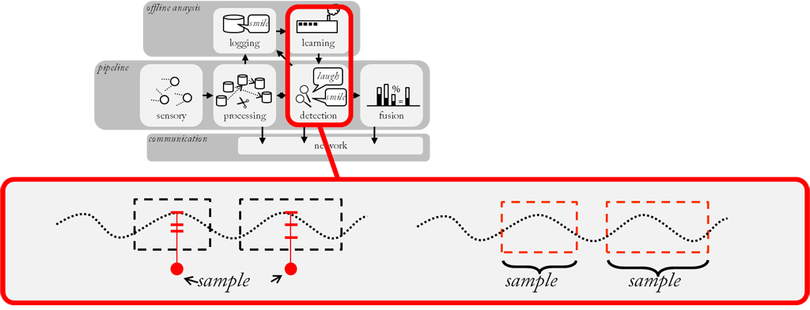{#fig:introduction-overview-3 width=80%}

To solve ambiguity in human interaction information extracted from diverse channels need to be combined. In SSI information can be fused at various levels. Already at data level, e. g. when depth information is enhanced with colour information. At feature level, when features of two ore more channels are put together to a single feature vector. Or at decision level, when probabilities of different recognizers are combined. In the latter cases, fused information should represent the same moment in time. If this is not possible due to temporal offsets (e. g. a gesture followed by a verbal instruction) fusion has to take place at event level. The preferred level depends on the type of information that is fused.

## Methodology {#introduction-methodology}

To reach a large community, a methodology is followed that addresses developers interested in extending the framework with new functions as well as end-users whose primary objective is to create processing pipelines from what is there. Again, a modular design pays off as it allows components to be classified into few general classes, such as "this-is-a-sensing-component" and "this-is-a-transforming-component". By masking individual differences behind a few basic entities it becomes possible to translate a pipeline into a another representation (and the other way round). This can be exploited to create an interface which allows end-users to create and edit pipelines outside of an expensive development system and without the knowledge of a complex computer language.

Developers, on the other hand, should be encouraged to enrich the pool of available functions. Therefore an API should be provided which defines basic data types and interfaces as well as tools to test components from an early state of development. In particular, the simulation of sensor input from pre-recorded files becomes an important feature, as it allows for a quick prototyping without setting up a complete recording setup, yet providing realistic conditions, e.g. by ruling out access to future data. Since all data communication is shifted to the framework, additional efforts are minimised.

{width=80%}

# Installation {#installation}

SSI is freely available from <http://openssi.net>. The core of SSI is released under [LGPL](https://www.gnu.org/licenses/lgpl-3.0.de.html). Plugins are either [GPL](https://www.gnu.org/licenses/gpl-3.0.de.html) or [LGPL](https://www.gnu.org/licenses/lgpl-3.0.de.html). To check out SSI you need an Apache Subversion (SVN) client (if you're on Windows you can use  [TortoiseSVN](https://tortoisesvn.net)). See INSTALL file for further installation instructions.

On Windows run ``setup.exe`` in the root folder to setup system variables and file associations (for the latter run as administrator) as shown [here](#fig:introduction-download-0). The interface allows you to pick platform and compiler. If you have a 64-bit machine you should always select ``x64`` since 32-bit is no longer officially supported (you will have to manually build 32-bit libraries). If you are not planning to develop new components in C++ just keep the default compiler (``vc140``) and make sure to have [Visual C++ Redistributable for Visual Studio 2015](https://www.microsoft.com/de-de/download/details.aspx?id=48145) installed. Otherwise choose the compiler version of your Visual Studio Version (e.g. ``vc120`` if you are using Visual Studio 2013).

> CAUTION: If you check out a second version of SSI in another folder on your file system run ``setup.exe`` on your current installation and use ``Undo`` to remove previous variables and associations before you switch to that version. This will make sure that only one installation of SSI exists in your ``%PATH%`` variable (multiple installations in the ``%PATH%`` will mess up your installations and possibly cause unexpected behaviour)!

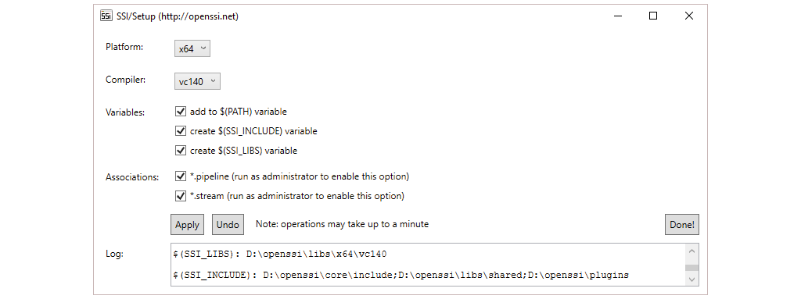{#fig:installation-0 width=80%}

If you want to use Python scripts in SSI get the 64-bit version of [Python3.5x](https://www.Python.org/downloads/) and install it to ``C:\%ProgramFiles%\Python35`` (default installation directory if you check 'install for all users'). We also recommend to install the [NumPy](http://www.numpy.org/) package. On Windows you may want to visit this [page](http://www.lfd.uci.edu/~gohlke/pythonlibs/) by Christoph Gohlke who is providing Windows binaries of many open-source extension packages (make sure to download 64-bit libraries). To install extensions use ``pip install <path>`` (you find ``pip.exe`` in the ``Script\`` folder of your Python installation).

# Background {#basics}

In the following chapter we will deal with the basic concepts of the SSI framework, in particular, the processing, buffering, and synchronisation of signal streams and the various levels at which information can be fused.

## Signals {#basics-signals}

Signals are the primary source of information in SSI. Basically, a signal conveys information about some physical quantity over time. By re-measuring the current state in regular intervals and chronically stringing these measurements we obtain a signal. In the following we will refer to a single measurement as a *sample* and denote a string of samples as a *stream*. By stepwise modifying a signal, we try to carve out information about a user's social behaviour. This is what social signal processing is about and it is the job of SSI to make it happen.

### Sampling {#basics-signals-sampling}

Basically, an analog signal is a continuous representation of some quantity varying in time. Since an analog signal has a theoretically infinite resolution it would require infinite space to store it in digital form. Hence, it is necessary to reduce the signal at discrete points of time to discrete quantity levels. To do so an analog signal is observed at fixed time intervals and the current value is quantised to the nearest discrete value of the target resolution. The process is visualised [here](#fig:basics-signals-sampling-0).
The graph shows a continuous signal (top) that is reduced to a series of discrete *samples* (bottom). In a digital world any signal is represented by a finite time-series of discrete samples. Following from the sampling procedure a digital signal is characterised by the frequency at which it is sampled, the so called *sampling rate*, and the number of bits reserved to encode the samples, the so called *sample resolution*.

{#fig:basics-signals-sampling-0 width=80%}

Both, sampling rate and sample resolution limit the information kept during conversion. For instance, given a resolution of 8 bit we can encode an analog input to one in 256 different levels. If the resolution is good enough to capture sufficient information about the signal, or if we have to enlarge the value range by allocating more bits, depends on the measured quantity. We can check it by determining the quantisation error, which is the difference between an analog value and its quantised value. The useful resolution is limited by the maximum possible *signal-to-noise ratio* (S/R) that can be achieved for a digitised signal. S/R is a measurement for the level of a desired signal to the level of background noise. If the converter is able to represent signal levels below the background noise additional bits will no longer contribute useful information.

Likewise we can also estimate the sample rate. According to the *Nyquist-Shannon sampling theorem* a perfect reconstruction of the analog signal is (at least in theory) possible if the sampling rate is more than twice as large as the maximum frequency of the original signal, the so called *Nyquist frequency*. To understand this relation, we first have to know what is meant by "maximum frequency". Let us start by defining a periodic signal. A periodic signal is a signal that completes a pattern after a certain amount of time and repeats that pattern over and over again in the same time frame. The length of the time frame in seconds is called *period* and the completion of a full pattern is called *cycle*. If the signal is a smooth repetitive oscillation, e.g. a *sine wave*, we can determine its *frequency* by counting the number of cycles per seconds. It is measured in units of *Hertz* (hz = $\frac{1}{second}$). [Here](#fig:basics-signals-sampling-1) we see sine waves with frequencies of 1, 2 and 4 hz. If we sum up the samples of the sine waves along the time axis we get another periodic signal (bottom graph). The maximum frequency of the combined signal is equal to the largest single frequency component, that is 4 hz. In fact, any periodic function can be described as sum of a (possibly infinite) set of sine waves (a so called Fourier series). According to the *Nyquist-Shannon sampling theorem* we must therefore sample the summed signal at a sample rate greater 8 hz.

{#fig:basics-signals-sampling-1 width=80%}

To illustrate the relation between the Nyquist frequency and the sample rate we can think of a periodic signal swinging around the zero axis. If the signal completes on cycle per second, i.e. has a (maximum) frequency of 1 hz, we will observe in every second a peak when signal values are above zero and a valley when signal values are below zero (see [here](#fig:basics-signals-sampling-1)). If the signal is sampled at a sampling rate of 1 hz, i.e. we keep only one value per cycle, we pick either always a positive or always negative value. Obviously, we will not be able to correctly reconstruct peaks and valleys. If we increase the sample rate to 2 hz, i.e. we sample twice per second, we have a good chance to get in each cycle a positive and a negative value. However, it may happen that we pick twice in the moment where the signal crosses the zero axis. In this case the sampled signal looks like a zero signal. Only by choosing a sample rate greater 2 hz we can ensure to pick at least one value from a peak and one value from a valley. [Here](#fig:basics-signals-sampling-2)
we see the summed signal from the previous example sampled at 4 hz, 8 hz and 16 hz. Only in the last case, where the sample rate is above the Nyquist frequency (8 hz), the original signal can be reconstructed.

{#fig:basics-signals-sampling-2 width=80%}

### Representation {#basics-signal-representation}

Signals play a fundamental role in SSI and an elegant way is needed to represent them. Since value type as well as update rate vary depending on the observed quantity, we need a generic solution that is not biased towards a certain type of signals.

For instance, let us consider the properties of a video signal versus that of a sound wave. The images in a video stream are represented as an assembly of several thousand values expressing the colour intensity in a two-dimensional grid. The rate at which images are updated is around 30 times per second. A sound wave, on the other hand, consists of single values quantifying the amplitudes, but is updated several thousand times per second. A tool meant to process video images will therefore differ very much from a tool designed to work with sound waves. To process a video stream we could grab a frame, process it, grab the next frame, process it, and so on. In audio processing such a sequential approach is not applicable because signals values have to be buffered first. And since update rates between values are much shorter and buffering cannot be suspended during processing, the two tasks have to be executed in parallel.

To deal with such differences, raw and processed signals should be represented using a generic data structure that allows handling them independently of origin and content. This can be achieved by splitting signals into smaller parts (*windows*) and wrap them in uniform packages of one or more values. To account for individual processing timing, packages can be of variable length. Treating signals as sequences of "anonymous" packets has the advantage that any form of buffering and transportation can be implemented independently of the signal source. The same kind of concept can be applied to handle gestures, key words and other higher level information which is not of a continuous nature. A generic wrapper for discrete events makes it possible to implement a central system to collect and distribute events. This allows for an environment that works with virtually any kind of continuous and discrete data produced by sensors and intermediate processing units. A useful basis for a framework intended to process multimodal sensor data.

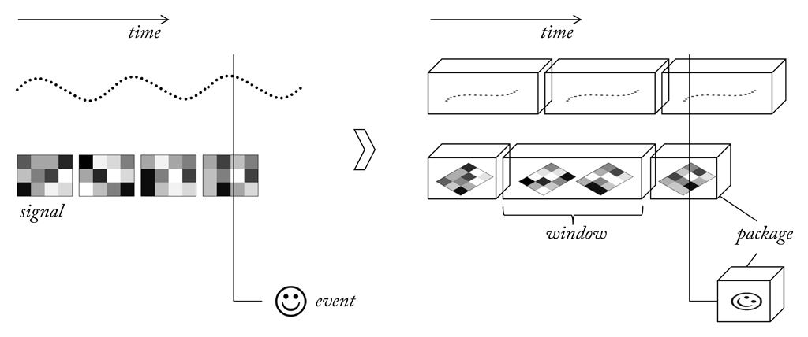{#fig:basics-signals-representation width=80%}

### Streaming {#basics-signals-streaming} 

In SSI, a *stream* is defined as a snapshot of a signal in memory or on disk, made of a finite number of samples. The samples in a stream are all of the same kind. In the simplest case a sample consists of a single number, which we refer to as a *sample value*. It can also be an array of numbers and in this case the size of the array defines the *dimension* of the sample. Instead of numbers the array may also contain more complex data types, e.g. a grouped list of variables. The number of samples in the stream, the sample dimension and the size of a single value in bytes are stored as meta information, together with the sample rate of the signal in hz and a time-stamp, which is the time difference between the beginning of the signal and the first sample in the stream. A stream is represented by a reference to a single memory block which holds the sample values stored in interleaved and chronological order. The total size of the data block is derived as the product of the number of samples $\times$ the sample dimension $\times$ the size of a single value.

Let us consider some [examples](#fig:basics-signals-streaming): 

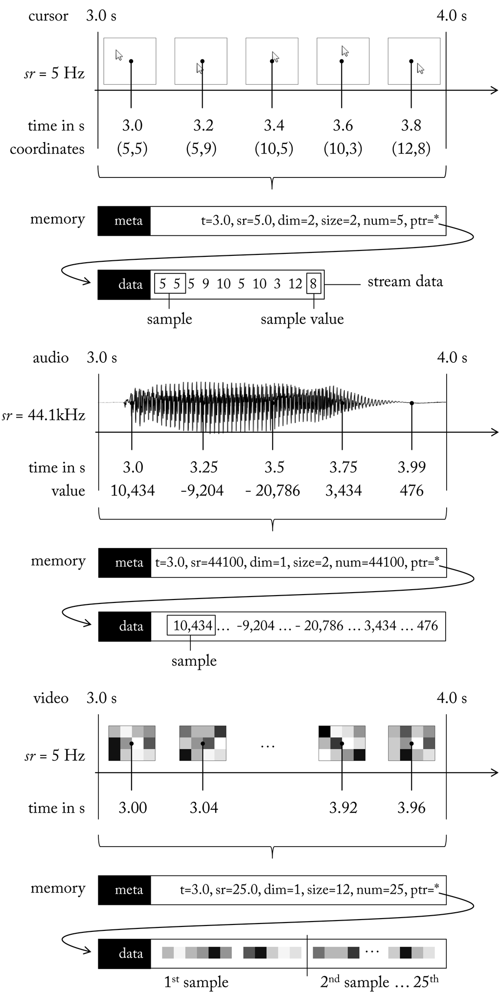{#fig:basics-signals-streaming width=80%}

On the top a stream storing the position of a mouse cursor for 1 s is shown. The sample rate is 5 hz, which means the cursor position is scanned 5 times within one second. Since the position of the mouse cursor is reported in x and y coordinates the stream has two dimensions. To store each coordinate 2 bytes (*short integer*) are reserved. In total the stream data measures 20 bytes (5 samples $*$ 2 dimensions $*$ 2 bytes). Although a single time-stamp is assigned for the whole stream we can easily give time stamps for each sample by adding the product of sample index and the reciprocal of the sample rate ($\frac{1}{5Hz} = 0.2$ s). For example, the last sample in the stream (index 4) is assigned a time-stamp of 3.8 s ($3.0 + 4 * 0.2$ s). This way of deriving time stamps make it redundant to store time stamps for all except the first sample.

Now, let us think of an audio signal (centre). In due consideration of the Nyquist-Shannon sampling theorem and since the human hearing covers roughly 20 to 20,000 hz, audio is typically sampled at 44,100 hz. The sample resolution is usually 16 bits (2 bytes), which yields a theoretical maximum S/R of 96 db (for each 1-bit increase in bit depth, the S/N increases by approximately 6 db). This is sufficient for typical home loudspeakers with sensitivities of about 85 to 95 db. The audio stream in Figure \ref{fig:signal-streams} stores a mono recording, hence stream dimension is set to 1. If it was stereo dimension would be 2. The sample values are integers within a range of -32,768 to 32,767, which exploits the full resolution of ${2}^{16} = 65,536$ digits.

Finally, on bottom a gray scale video stream is given. For demonstration purposes the video images have a resolution of $4\times3$ pixel, i.e. an image consists of 12 gray scale values. It may seem surprising that the stream dimension is still 1 not 12. This becomes clear if we consider a stereo camera which delivers images in pairs. If the dimension would be the sum of pixels from both images we could no longer decide whether it is two images or a single image with twice as many pixels. Hence, to avoid ambiguities we treat each image as a single sample value. Given that the gray scale information of a pixel is encoded with 1 byte the size of a sample value is 12 bytes. Thus, the total size of the video stream is 300 bytes (1 s $*$ 25 hz $*$ 12 bytes). Since a standard webcam delivers images in RGB or YUV (3 bytes per pixel) at a resolution of $320\times240$ pixels up to $1600\times1200$ pixels the space to store of a single sample value can actually take up several *MB*, e.g. $1600*1200*3$ bytes $= 5,760,000$ bytes $= 5.76$ *MB*.

### Buffering {#basics-signals-buffering}

Signal flow describes the path a signal takes from source to output. As described, streams offer a convenient way to implement this flow as they allow handling signals in small portions. If we define a *source* as an entity which outputs a signal and a *sink* as an entity which receives it, a natural solution would be to simply pass on the data from source to sinks. However, in this case the intervals at which a sink is served would be steered by the source. This is not feasible, since a sink may prefer a different timing. For example, a source may have a new sample ready every 10 ms, but a sink only asks for input every second. Hence data flow should be delayed until 100 samples have been accumulated. This can be achieved by temporarily storing signal samples in a *buffer*.

A buffer knows two operations: either samples are written to it, or samples are read from it. It is tied to a particular source and signal, i.e. it stores samples of a certain type, and can connect one ore more sinks (see [here](#fig:basics-signals-buffering-0)).
Since memory has a finite size, a buffer can only hold a limited number of these samples. When its maximum capacity is reached there are two possibilities to choose from: either enlarge the buffer, which only pushes the problem one stage back, or to sacrifice some samples to make room for new ones. The latter is exactly the function of a so called *circular buffer* (also *ring buffer*).

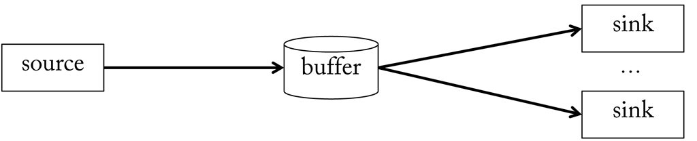{#fig:basics-signals-buffering-0 width=80%}

A circular buffer is a data structure that uses a single, fixed-size buffer as if it were connected end-to-end. A circular buffer has the advantage that elements need not be shuffled around when elements are added. It starts empty pointing to the first element (*head*). When new elements are appended the pointer is moved accordingly. Once the end is reached the pointer is again moved to the first position and the buffer begins to overwrite old samples (see [here](#fig:basics-signals-buffering-1)). The simple logic of a circulate buffer suites a highly efficient implementation, which is important given the high frequency of read and write operations a buffer possibly has to handle.

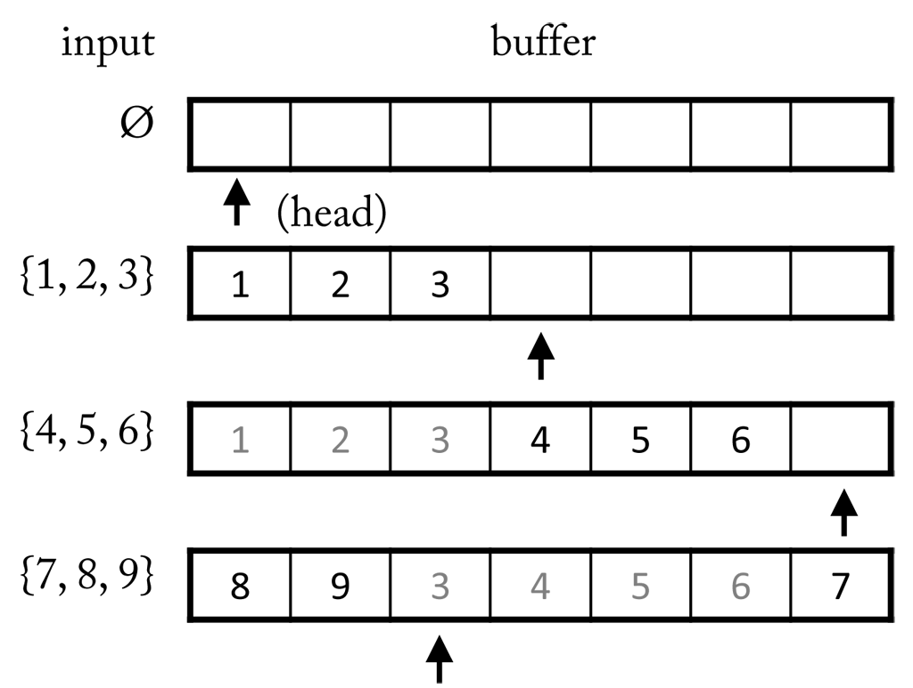{#fig:basics-signals-buffering-1 width=80%}

When a sink reads from a buffer, it sends a request to receive all samples in a certain time interval. If the data is available a stream including a copy of the samples is returned, i.e. during read operations the content of a buffer is not changed (see Figure (see [here](#fig:basics-signals-buffering-2)). Hence, multiple read operations are supported in parallel. During a write operation, on the other hand, a stream with new samples is received by the buffer, which will possibly replace previous samples. Consequently, writing samples to a buffer alters its content and therefore should be handled as an atomic, i.e. exclusive, operation. This is achieved by locking the buffer as long as write operation is in progress, which guarantees that no read operations occur in the meanwhile. (see [here](#fig:basics-signals-buffering-3))
we see the content of a buffer before and after a write operation. If we compare the unfolded streams we see that new samples were appended to the front of the stream at cost of samples at the ending.

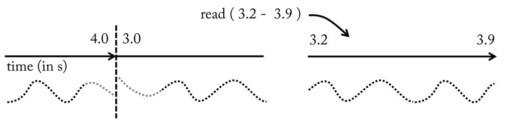{#fig:basics-signals-buffering-2 width=80%}

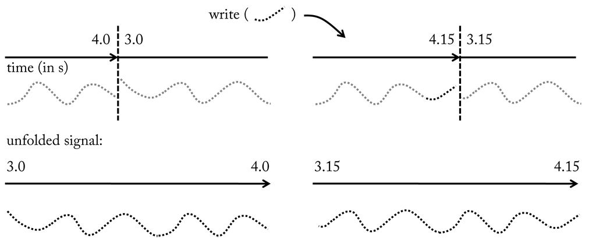{#fig:basics-signals-buffering-3 width=80%}

## Pipelines {#basics-pipelines}

On October 1, 1908, the Ford Motor Company released "Model T", which is regarded as the first affordable automobile and became the world's most influential car of the 20th century. Although Model T was not the first automobile it was the first affordable car that conquered the mass market. The manufacturing process that made this possible is called an *assembly line*. In an assembly line interchangeable parts are added as the semi-finished assembly moves from work station to work station where the parts are added in sequence until the final assembly is produced. The huge innovation of this method was that car assembly could be split between several stations, all working simultaneously. Hence, by having $x$ stations, it was possible to operate on a total of $x$ different cars at the same time, each one at a different stage of its assembly.

The same kind of technique is adopted in SSI to achieve an efficient processing of the signals. Work stations are replaced by *components* which receive and/or output one or more streams, possibly altering the content. By putting multiple components in series, a processing chain is created to transform raw input into something more useful. And like in the case of Henry Ford's assembly lines, the components can work simultaneously. We call such a chain *pipeline*. Since a pipeline can branch out into multiple forks, but also join forks, it represents a *directed acyclic graph*.

### Signal Flow {#basics-pipelines-signalflow}

A pipeline is a chain of processing components, arranged so that the output of each component feeds into successive components connected by a buffer (see [here](#fig:basics-pipelines-signalflow-0)).
Although such an intermediate step introduces a certain amount of overhead caused by copy operations during read and write operations, it bears several advantages. First of all, the output of a component can be processed in parallel by several independent components and, as already pointed out earlier, read and write operations can be performed asynchronously. To actually make this possible, SSI starts each component as a thread. This is an important feature, since components in front of the the pipeline often work on high update rates of a few milliseconds, whereas components towards the end of a pipeline operate at a scale of seconds. The length at which a signal is processed is also called *window* length. Generally, we can say that the window length in the pipeline grows with position. Apart from offering more flexibility this also has practical advantages, since components further back in the pipeline cannot cause a delay in the front of the pipeline, which may lead to data loss (Of course, this assumes a proper buffering of intermediate results generated by components from the front until they are ready to be processed by the slower components in at the end). Finally, running components in different threads helps to make the most of multi-core systems.

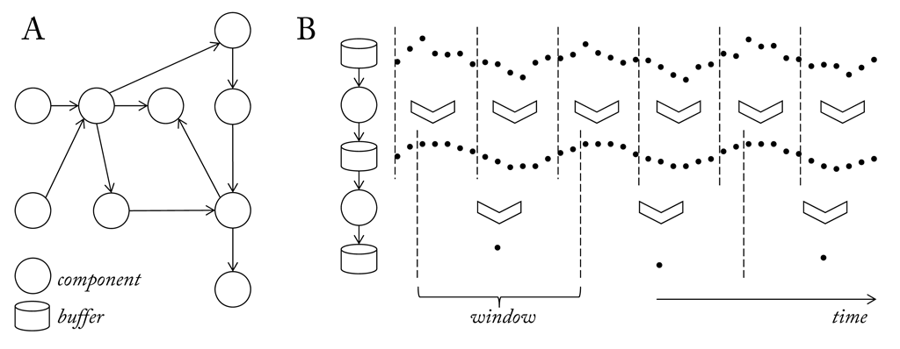{#fig:basics-pipelines-signalflow-0 width=80%}

An efficient handling of the signal flow between the components of a pipeline is one of the challenges to a real-time signal processing framework. The problems to be dealt with are similar to those in a *consumer-producer problem* (also known as *bounded-buffer problem*). The problem describes two processes, the *producer* and the *consumer*, who share a common, fixed-size buffer. The producer generates data and puts it into the buffer. The consumer consumes data by removing it from the buffer. Hence, the producer must not add data into the buffer if it is full and the consumer must not try to remove data if the buffer is empty. A common solution would be to put the producer to sleep if the buffer is full and wake it up next time the consumer begins to remove data again. Likewise the consumer is put to sleep if it finds the buffer to be empty and awaked when the producer starts to deliver new data. An implementation should avoid situations where both processes are waiting to be awakened to not cause a deadlock. And in case of multiple consumers what is known as starvation, which occurs if a process is perpetually denied data access.

Transferred to the problem at hand there are two differences. First, we can always write to a circular buffers since old values are overwritten when the buffer is full. And second, components do not remove data but get a copy. So except for the beginning a buffer is never empty. However, if a component requests data that have already been overwritten, we still encounter the situation where the requested data cannot be delivered. Either because a component requests samples for a time interval that is not yet fully covered by the buffer. In this case we should put the calling component in a waiting state until the requested data pops up. Or because the requested samples are no longer in the buffer. In this case the operation will never succeed so we should cancel it. As already pointed out earlier write requests should be handled as atomic operations. To prevent starvation, waiting components are put in a queue and awakened in order of arrival.

At run-time components are operated at a *best effort delivery*, which means data is delivered as soon as it becomes available. When a component receives the requested stream it applies the processing and returns the result. Afterwards it is immediately put on hold for the next data chunk. Ideally, the first component in a pipeline functions as a sort of bottle neck and following components finish in average before the next chunk of samples becomes available. This guaranties that the pipeline will run in real-time. However, since stream data is buffered for a certain amount of time, components are left some margin to finish their task. The window length at which a component operates depends on the algorithm, but also the kind of signal. An audio stream, for instance, which has a high sample rate, is usually processed in chunks of several hundred or even thousand samples. Video streams, on the other hand, are often handled on a frame-by-frame base. While the number of samples in a stream may vary with each call, sample rate and sample dimension must not change. Due to the persistence of streams most resources can be allocated once in the beginning and then be reused until the pipeline is stopped.

A simple example demonstrating the data flow between components of a pipeline is shown [here](#fig:basics-pipelines-signalflow-1).

![*The figure depicts the data flow between two components **C1** and **C2** connected through a buffer. Samples are represented by dots in varying gray colours. At each step **C1** writes two samples to the buffer and **C2** sends a request for three samples. Note that although it looks like a synchronous sequence, read and write requests are actually asynchronous operations as **C1** and **C2** run in different threads. Only for the sake of clearness we will treat them in discrete steps triggered by **C1**. In the beginning the buffer is empty and both components are in a waiting state. At step I, **C1** writes two samples to the buffer. Since **C2** requests three samples it is left in waiting state. At step II, **C1** appends another two samples summing up to four samples so that **C2** receives three of them. At step III, **C1** again adds two samples and **C2** receives them together with the sample left over from the previous call. At step IV, **C2** is again in a waiting state, since only two new samples are available and so on.*](pics/basics-pipelines-signalflow-1.png){#fig:basics-pipelines-signalflow-1 width=80%}

### Components {#basics-pipelines-components}

It is the goal of SSI to let developers quickly build pipelines, but hide as many details about the internal data flow as possible. Components offer this level of abstraction. A developer only indicates the kind of streams to be processed (input and/or output) and proceeds on the assumption that the desired streams will be available at run-time. And when building the pipeline he connects the components as if they directly exchanged data. As shown [here](#fig:basics-pipelines-components-0) only the top layer, which defines the connection between the processing components, is visible to the developer, while the bottom layer remains hidden.

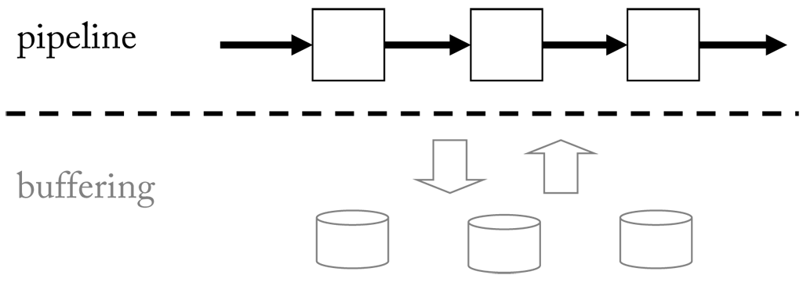{#fig:basics-pipelines-components-0 width=80%}

Pipelines are built up of three basic components denoted as *sensor*, *transformer*, and *consumer*. A sensor can be the source of one or more streams, each provided through a separate *channel*. Most webcams, for instance, also include an in-built microphone to capture sound. In this case, the audio stream will be provided as a second channel in addition to the video channel. A consumer is the counterpart of a sensor. It has one or more input streams, but no output. Transformers are placed in between. They have one ore more input streams and a single output stream. By connecting components in series we can build a pipeline like the one [here](#fig:basics-pipelines-components-1).

![*Pipelines are built up of three basic components denoted as **sensor**, **transformer**, and **consumer**. A sensor is the source of one or more streams. A transformer receives streams, manipulates them and forwards the result in a single stream. A consumer reads one or more streams, but has no output. By connecting components in series we can build a pipeline like the one in the lower part of the figure. It begins with three streams (1), which are processed along different branches (2), and finally combined by a single component (3).*](pics/basics-pipelines-components-1.png){#fig:basics-pipelines-components-1 width=80%}

A transformer may change the sample rate of an input stream (usually making it smaller by reducing the number of samples in the output stream). For the special case that in each window the input stream is reduced to a single sample we call the transformer a *feature*. And for the special case that the sample rate remains unchanged we call it a *filter*. The difference is depicted in the [following](#fig:basics-pipelines-components-2) figure.
Of course, filter and feature may change the number of dimensions just like a regular transformer. 

{#fig:basics-pipelines-components-2 width=80%}

When we move a window over a stream we call it a *sliding* window. In each step the content of a sliding window is retrieved and processed. Afterwards, the window is usually moved by a certain length, which we call the *frame* size. Often, the frame size is identical to the window size. However, sometimes an overlap between successive windows is desired and in that case the frame size is smaller than the window size. The gap between the frame and the window size is called *delta* size. If the delta size is non-zero, the sample rate of a feature component is actually the reciprocal of the frame size and not the window size. The relation is depicted [here](#fig:basics-pipelines-components-3). 

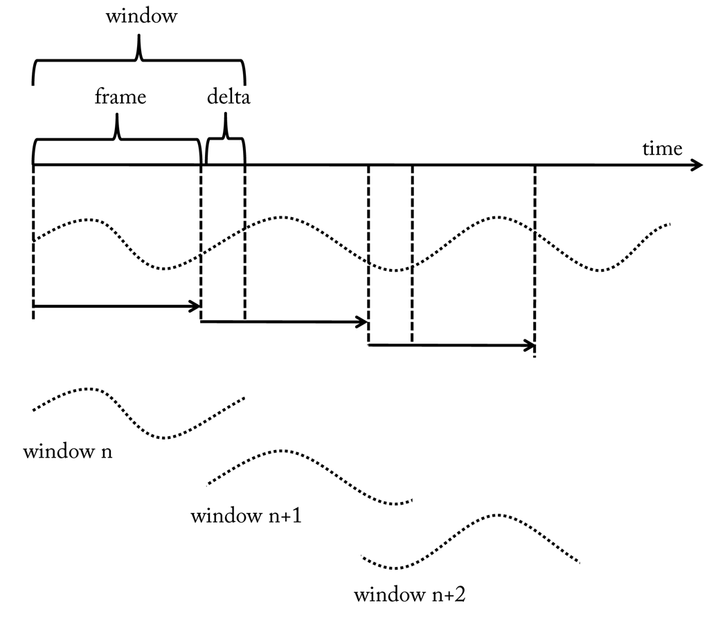{#fig:basics-pipelines-components-3 width=80%}

### Synchronization {#basics-pipelines-synchronization}

A system is *time synchronous* or *in sync* if all parts of the system are operating in synchrony. Transferred to a pipeline it means we have to be able to specify the temporal relation between samples in different branches, even if they originate from individual sensor devices. Only then it becomes possible to make proper multimodal recordings and to combine signals of different sources. To keep streams in sync, SSI uses a two-fold strategy: First, it is ensured that the involved sensors start streaming at the same time. Second, in regular intervals it is checked that the number of actually retrieved samples matches the number of expected samples (according to the sample rate).

To achieve the first, SSI hast to make sure all sensor devices are properly connected and a stable data stream has been established. Yet, samples are not pushed into the pipeline until a signal is given to start the pipeline. Only then, buffers get filled. Theoretically, this should guarantee that streams are in sync. Practically, there can still be an offset due to different latencies that it takes for the sensors to capture, convert and deliver the measured values to the computer. However, it is hardly possible to compensate for those differences without using special hardware. Given that these latencies should be rather small (< 1 ms), it is reasonable to ignore them.

Actually, if sensors would now stick precisely to their sample rate, no further treatments were necessary. However, fact is that hardware clocks are imperfect and hence we have to reckon that the specified sample rates are not kept. Hence, the internal timer of a buffer, which is updated according to an "idealised" sample rate, will suffer from a constant time drift. To see why, let us assume a sensor that is supposed to have a sample rate of 100 hz, but in fact provides 101 samples every second. During the first 100 s we will receive 10100 samples, which results in a drift of 1 s. And after one hour we will already encounter an offset of more than half a minute. Matching the recording with another signal captured in parallel is no longer possible unless we are able to measure the drift and subtract it out which is impossible if it is non-linear.

Obviously, such inaccuracies will propagate through the pipeline and cause a time drift between branches originated by different sources. The pipeline will be out of sync. To solve this issue we can compare the buffer clock with a global time measure applying a similar strategy that is used in sensor networks. Only, that in our case the propagation time to receive the global time can be neglected since it is directly obtained from the operating system. Let us understand what happens when we adjust the internal clock of a buffer. If the sample rate was lower than expected it means that too few samples were delivered. If we now set the clock of the buffer ahead in time components that are waiting for input will immediately receive the latest sample(s) once again. And this will compensate the loss. Accordingly, if the sample rate was greater than expected it means that we observe a surplus. In this case the buffer is ahead of the system time. If we reset the clock of the buffer, components that are on hold for new input, now will have to wait a little bit longer until the requested samples become available. Practically, this has the effect that a certain number of samples are omitted.

Of course, duplicating and skipping samples changes the propagated streams and may introduce undesired artefacts. However, as long as a sensor works properly we talk about a time drift of few seconds over several hours at the worst. If buffers are regularly synchronised only every now and then a single sample will be duplicated or skipped. Now, what if a sensor stops providing data, e.g. because the connection is lost? In this case updating the buffer clock would cause the latest samples to be sent over and over again. A behaviour which is certainly not desirable. Hence, if for a certain amount of time no samples have been received from a sensor, a buffer will start to fill in default samples, e.g. zero values. Although we still lose stream information at least synchronisation with other signals is kept until the connection to the sensor can be recovered (see [here](#fig:basics-pipelines-synchronization-0)).

{#fig:basics-pipelines-synchronization-0 width=80%}

So far, we have considered synchronisation at the front of a pipeline. Now let us focus on a transformer, which sits somewhere in between. As long as a transformer receives input at a constant sample rate and outputs at a constant rate this will preserve synchronisation. For example, a transformer that always outputs half as many samples as it received as input, will exactly halve the sample rate. However, it may happen that a transformer works too slow, i.e. is not able to process the incoming stream in real-time. For some while this will be picked up by the buffer it receives the input from. But at some point the requested samples will not be available since the they date too far in the past. Now the pipeline will block. To prevent this situation transformers can work asynchronously. A transformer that runs in asynchronous mode does not directly read and write to a buffer. Instead it receives samples from an internal buffer that is always updated with the latest samples from the regular input buffer. This prevents the transformer to fall behind. A second internal buffer provides samples to the regular output buffer according to the expected sample rate and is updated whenever the transformer is able to produce new samples (see [here](#fig:basics-pipelines-synchronization-1)).

![*A transformer that runs in synchronous mode receives samples directly from the input buffer, manipulates them and writes the result to the output buffer. To not fall behind and block the pipeline it supposed to finish operations in real-time. If this cannot be guaranteed it is run asynchronously. In this case two intermediate buffers ensure that samples can be constantly transferred according to the sample rate. Whenever the transformer has successfully processed data from the internal input buffer it updates the values in the internal output buffer.*](pics/basics-pipelines-synchronization-1.png){#fig:basics-pipelines-synchronization-1 width=80%}

### Events {#basics-pipelines-events}

So far we have exclusively talked about continuous signals. However, at some point in the pipeline it may not be convenient any more to treat information in form of continuous streams. An utterance, for instance, will neither occur at a constant interval, nor have equal length as it depends on the content of the spoken message. The same is true for the duration of a gesture, which depends on the speed at which it is performed or even shorter spans such as fixations and saccades in the gaze. Also changes in the level of a signal, e.g. a raise in pitch or intensity, may occur suddenly and at a irregular time basis. At this point it makes sense to stick to another representation, which we denote as *events*. An event describes a certain time span, i.e. it has an start and end time, relative to the moment the pipeline was started and in this way are kept in sync with the streams. But in contrast to streams they are not committed to a fixed sample rate, i.e. they do not have to occur at a regular interval. Events may carry meta information, which add further description to the event. For instance, the recognised key word in case of a key word event.

Components can send and receive events, and each event has an *event name* and a *sender name* to identify its origin. The two names form the address of the event: *event@sender*. The event address is used to register for a certain type of events. Addresses of different events can be put in row by comma, e.g. *event1,event2@sender1,sender2*. Omitting one side of the address will automatically register all matching events, e.g. *@sender* will deliver all events of the specific sender and a component listening to *@* will receive any event. There can be any kind of meta data associated with an event, e.g. an array of numbers, a string, or more complex data types. Events are organised in a global list and in a regular interval forwarded to registered components. A component will be notified how many new events have been added since the last update, but may also access previous events (see [here](#fig:basics-pipelines-events-0)).

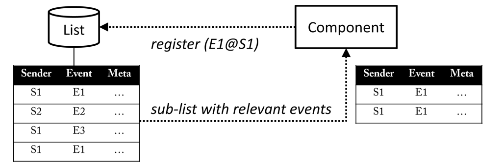{#fig:basics-pipelines-events-0 width=80%}

Since a consumer does not output a new stream, events can be used to *trigger* when data should be consumed. In this case the consumer does not receive continuous input, but is put in waiting state until the next event becomes available. When a new event occurs, it will be provided with the stream that corresponds to the time frame described by the event as depicted [here](#fig:basics-pipelines-events-1). In this way, processing can be triggered by activity, e.g. apply key word spotting only when voice is detected from the audio. Of course, it is also possible to trigger across different modalities. For instance, activate key word spotting only if the user is looking at certain objects as then we expect him to give commands to manipulate the object.

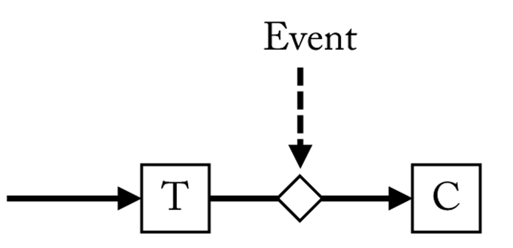{#fig:basics-pipelines-events-1 width=80%}

## Pattern Recognition {#basics-patternrecognition}

Machine-aided learning offers an alternative to explicitly programmed instructions. It is especially useful to solve tasks where designing and programming explicit, rule-based algorithms is infeasible. Instead of manually tuning the recognition model, appropriate model parameters are automatically derived after having experienced a learning data set. The quality of a model depends on its ability to generalize accurately on new, unseen examples. SSI supports all steps of a learning task, that is feature extraction, feature selection, model training, and model evaluation. Special focus was put to support both, dynamic and static learning schemes as well as various kind of fusion strategies.

### Feature Extraction {#basics-patternrecognition-featureextraction}

Generally spoken, a *feature* transforms a signal chunk into a characteristic property. Choosing discriminating and independent features is key to any pattern recognition algorithm being successful in classification. For instance, calculating the energy of an utterance will reduce a series of thousand measurements to a single value. But whereas none of the original sample values is meaningful by itself, the energy allows for a direct interpretation, e.g. a low energy could be an indication of a whispering voice. By this means features help to carve out information relevant to the problem to be investigated, while at the same time the amount of data is considerably reduced. However, usually it is not a single, but a bunch of features that are retrieved, each describing another characteristics of the input signal. It is common practice to represent features by numerical values or strings and group them into *feature vectors*.

Features that reduce an input sequence to a single value are *statistical* features or *functionals*. Typical functionals are mean, standard deviation, minimum, maximum, etc.. But sometimes, the original sequence is also transformed into a new, although shorter sequence. Such features are called *short-term* features. To extract them a window is moved over the input sequence and a feature vector is extracted at each step. Often, successive windows overlap to a certain degree. In this case, the *frame size*, also called *frame step*, defines how much the window will be moved at each step. Often, the extraction of short-term features is only an intermediate stage which leads to another feature extraction stage. The relationship is visualised [here](#fig:basics-patternrecognition-featureextraction-0).

{#fig:basics-patternrecognition-featureextraction-0 width=80%}

A "good" feature encodes information that is relevant to the classification task at hand. In other words, there is a sort of correlation between distribution of feature values and the target classes, which allows reasoning the class from the feature. [Here](#fig:basics-patternrecognition-featureextraction-1) we see the pitch contour of three utterances articulated with either a happy or a sad voice. Although the semantic content of the sentences is the same their pitch contour is different ("Das will sie am Mittwoch abgeben" ("She will hand it in on Wednesday"), taken from ["Berlin Database of Emotional Speech"](http://www.expressive-speech.net/)). This also applies for examples belonging to the same class, which makes it difficult to compare the sentences. By taking the average of the contours local changes are discarded and it becomes more obvious which utterances draw from the same class.

![*Although the wording is the same for the three sentences, they differ in their pitch contour. If articulated with a happy voice (top graph), there are more variations in the pitch contour and in average pitch values are higher compared to sentences pronounced with a sad voice. But even if emotional expression match, there are variations in the pitch contour due a different speaking timing (compare the two bottom graphs). By taking the average of the contours (dotted line) local changes are discarded and their relationship becomes more obvious.*](pics/basics-patternrecognition-featureextraction-1.png){#fig:basics-patternrecognition-featureextraction-1 width=80%}

### Classification {#basics-patternrecognition-classification}

Generally, a *classifier* is a system that maps a vector of feature values onto a single discrete value. In supervised learning the mapping function is inferred from labelled training data. The success of this learning procedure depends on the one hand on the *feature representation*, i.e. how the input sample is represented, and on the other hand on the *learning algorithm*. The two entities are closely connected and one cannot succeed without the other. The learning task itself starts from a set of training samples which encode observations whose category membership is known. A training sample connects a measured quantity, usually represented as a sequence of numbers or a string, with a target. Depending on the learning task targets can be represented as discrete class labels or continuous values. The aggregation of training samples is called a dataset. The learning procedure itself works as follows: a set of training samples is presented to the classification model and used to adjust the internal parameters according to the desired target function. Afterwards, the quality of the model is judged by comparing its predictions on previously unseen samples with the correct class labels.

[Here](#fig:basics-patternrecognition-classification-0) 
we see an example of a simple facial expression recogniser. A database is created with images showing faces in a *happy*, *neutral*, and *sad* mood. Images are grouped according to their class labels and represented by two features: one value expressing the opening of the mouth and a second value measuring the distance of the mouth corner to the nose tip. Since position and shape of the mouth are altered during the display of facial expressions, we expect variations in the features that are distinctive for the target classes. Identifying possible variations in the training samples and embedding them in a model that generalises to the whole feature space is the crucial task of a classifier. The example shows the position of each sample in the feature space that is spanned by the two features. We can see that samples representing the same class tend to group in certain areas of the feature space. In the concrete case, *happy* samples - mouth opened and lip corners raised - end up top left, whereas sad samples - mouth closed and lip corners pulled down - are found in the right down. Distance between mouth corner and nose tip turns out to be of similar for *neutral* and *sad* samples, so that they are only distinguishable by the opening of the mouth. Based on the distribution of the samples the feature space is now split in such way that samples of the same class preferably belong to the same area. The boundaries between the areas are called decision boundaries.

![*In a facial expression recognition task samples are selected from the area around the mouth in four classes: **happy**, **neutral** and **sad** (left). Each sample is represented by a feature tuple -- opening of the mouth and distance of the mouth corner to the nose tip. Based on the training samples a linear model is learned to separate the feature space according to the three classes (middle). Unknown samples are classified according to their position relative to the decision boundaries in the feature space (right).*](pics/basics-patternrecognition-classification-0.png){#fig:basics-patternrecognition-classification-0 width=80%}

As illustrated [here](#fig:basics-patternrecognition-classification-1) 
a classifier in SSI is a hierarchical construct that combines the decisions of an ensemble of models in a final fusion step. The samples in the training set can stem from multiple sources, whereby each model is assigned to a single source. However, it is well possible to have different models receive input from the same source. Before samples are handed over to a model they may pass one ore more transformations. Also, if only a subset of the features should participate in the classification process an optional selection step can be inserted to choose relevant features. The learning phase starts with training each of the models individually. Afterwards the fusion algorithm is tuned on the probabilities generated by the individual models. The output of the fusion defines the final decision and is output by the classifier.

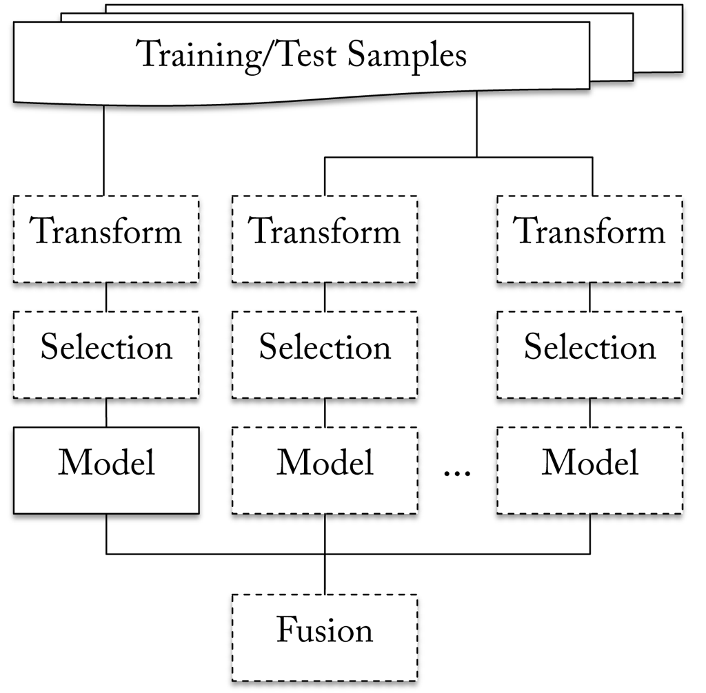{#fig:basics-patternrecognition-classification-1 width=80%}

### Fusion Levels {#basics-patternrecognition-fusionlevels}

Combining the predictions of an ensemble of classifiers is one way to fuse information. However, SSI offers several more possibilities. At an early stage two or more streams can be merged into a new stream, which is *data level fusion*. An example for data fusion is *image fusion*, which is the process of registering and combining multiple images from single or multiple imaging modalities to improve the imaging quality and reduce randomness and redundancy. Early data fusion in SSI is implemented using a transformer with multiple input streams (see [here](#fig:basics-patternrecognition-fusion)).

Combing multimodal information at *feature level* is another option. It provides more flexibility than data fusion since features offer a higher level of abstraction. In feature level fusion features of all modalities are concatenated to a super vector and presented to a classifier. Usually, classifiers are seated in a consumer and the result of a classification is output as an event. However, if classification is applied on a frame-by-frame basis, it can be replaced by a transformer. In this case, class probabilities are written to a continuous stream. *Decision level fusion* is similar, but individual features sets are classified first and then class probabilities are combined afterwards. Feature and decision level fusion can be implemented using the techniques described in the previous section.

Finally, information can be combined at *event level*. In this case the information to be fused has to be attached to the events, e.g. the result of previous classification steps. Fusing at event level has the advantage that modalities can decide individually when to contribute to the fusion process. If no new events are created from a modality it stays neutral.

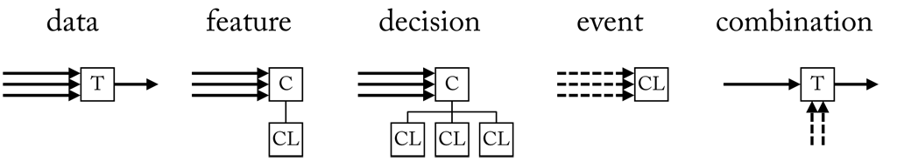{#fig:basics-patternrecognition-fusion width=80%}

# XML {#xml}

In the following we will learn how to build pipelines in XML. XML offers a very simple, yet powerful way to describe the signal flow within a pipeline. At run-time XML pipelines are translated into pre-compiled C++ code and run without loss of performance. However, it is not possible to develop new components in XML.

## Basics {#xml-basics}

The following section covers basic concepts by means of an XML pipeline that reads, manipulates, and outputs the position of the mouse cursor.

### Run a Pipeline {#xml-basics-interpreter}

XML pipelines in SSI are framed by:

``` xml
<?xml version="1.0"?>
<pipeline ssi-v="1">
...
</pipeline>
```

To run a pipeline an interpreter is used that is called ``xmlpipe`` (xmlpipe.exe on Windows) and which is located in the ``bin\`` folder of SSI followed by two sub-folders that indicate the platform (e.g. ``x64\``) and the compiler version (e.g. ``vc140\``). It is recommended to add this folder to the ``PATH``. On Windows you can use ``setup.exe`` in the root folder of SSI, which also allows it to set up other helpful variables and link pipelines to the interpreter (in that case double clicking a pipeline is sufficient to start it). Before we can run a pipeline we save it to a file ending on ``.pipeline``. Now we open the command line and navigate to the directory where we execute the following command:

```
> xmlpipe -debug <path> <filepath-with-or-without-extension>
```

By adding the option ``-debug`` we can store the console output to a file or stream it to a socket port (if in format <host>:<port>).

When calling a pipeline the working directory is set to the folder where the pipeline is located, i.e. resources used by the pipeline are searched relative to the folder of the pipeline and not the interpreter. Sole exception are plug-ins (see [next](#xml-basics-component) Section), which are searched relative to the folder where the interpreter is located.

> Note that ``xmlpipe`` does **not** work if the file path contains blanks. As a workaround add ``xmlpipe`` to the ``%PATH%`` and start the pipeline from the directory where it is located.

### Use a Component {#xml-basics-component}

To use a component in an XML pipeline we have to import it from a *dynamically-linked library* (*.dll* on Windows or *.so* on Linux) we call a *plug-in*. By convention SSI plug-ins have the prefix ``ssi``, which is possibly added. The file extension is optional, too. E.g.

``` xml
<register>
	<load name="mouse"/>
</register>
```

tells SSI to look for a file called ``ssimouse.dll`` (or ``ssimouse.so`` on Linux) (note that the ``frame`` and ``event`` plug-in are loaded implicitly). If it is not an absolute path, the file is first searched relative to the folder of the interpreter. If it is not found the directories in the ``PATH`` are finally examined. If a file with the name was found the contained components are registered (if a plug-in with that name has already been imported a warning is given). To know which components will be loaded we can browse the [API](api/index.html), e.g.:

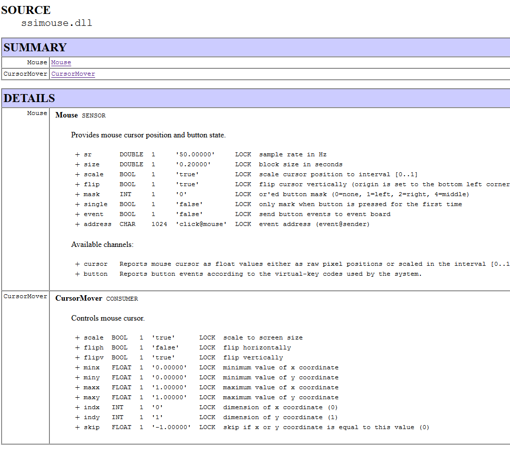{#fig:xml-basics-components width=80%}

Here, we see two components (``Mouse`` and ``CursorMover``) with available options. Each option row starts with the name of the option (e.g. ``sr``). We use this name to address the option. It is followed by the type (e.g. ``DOUBLE``) and the number of elements. If the number is 1 a single value is expected (e.g. ``50.0``), otherwise a list of values seperated by ``,`` (e.g. ``1,2,3``). Sole exception are strings, which are represented as a list of ``CHAR`` values without delimiter (e.g. ``click@mouse``). By default option values must not be changed at run-time, which is indicated by the ``LOCK`` field. However, there are exceptions as we will see [later](#xml-advanced-options). The last entry in the row adds a descriptions to the option. There is no limit on the number of options. 

We can now create an instance of ``Mouse``, change the sample rate from 50 Hz (default value) to 10 Hz and move the origin of the screen to the bottom left corner:

``` xml
<object create="Mouse" sr="10" flip="false"/>
```

Note that the XML is parsed top-down and the order matters. For instance, you cannot use a component before the according plug-in was loaded. Even if the plug-in will be loaded later on, an error will occur. Same is true for pin connections (see [below](#xml-basics-sensor)), 
which must not be used by a sink before they declared by a source.

We possibly want to create several instances of the same object. To tell them apart SSI automatically assigns an unique id to every instance, which by default is ``noname`` followed by a consecutive number (e.g. ``noname002``). We can manually assign a different id by adding ``:<id>`` after the componenent name, e.g.: 

``` xml
<object create="Mouse:mouse" sr="10" flip="false"/>
```

If the id is already taken a consecutive number is added to make it unique. Instead of applying options in-place, we can also load them from a file using the reserved attribute ``option``:

``` xml
<object create="Mouse:mouse" option="mouse" sr="10" flip="false"/>
```

When the previous line is parsed, SSI will first look if a component with an according name has been registered. If this is the case, a new instance with id ``mouse`` and default options is created. If the ``option`` attribute is set, SSI looks for a file ``mouse.option``. If a relative path is used, the file is searched relative to the folder where the pipeline is located. If the according file is found, options in the file will override the default options (if the according file does not exist, it will be created and filled with default options). However, those values are possibly replaced if options are provided in-place. When the pipeline is closed a snapshot of the current option values is written back to the file (options may change during the execution of the pipeline!). Note that options provided in-place will again override those values at the next start.

### Sensor {#xml-basics-sensor}

When we look at the [description](#fig:xml-basics-components) 
of the ``mouse`` plug-in, in the ``DETAILS`` section we see that components are followed by an additional identifier, e.g. ``SENSOR`` in case of ``Mouse`` or ``CONSUMER`` in case of ``CursorMover``. We have already learned about the different roles [components](#basics-pipelines-components) can adopt. This basically determines whether a component can be used to produce, manipulate or consume [streams](#basics-signals-streaming). When we add a component to a pipeline we can use certain keywords to apply this role. In case of a sensor we use the keyword ``sensor``:

``` xml
<sensor create="Mouse:mouse" option="mouse" sr="50.0" mask="1">
	<output channel="button" pin="button" />
	<output channel="cursor" pin="pos" />
</sensor>
```

A sensor owns one or more channels each providing another quantity. The channels that are available for a sensor are listed after the options in the [description](#fig:xml-basics-components) of the component. To establish a connection to a channel we add a tag ``<output>``. It expects two attributes: ``channel``, which is the name of the channel, and ``pin``, which defines a freely selectable identifier used by other components to connect to the stream provided on that channel. 

In the example, we connect two channels: The first channel ``button`` monitors if certain buttons on the mouse are pressed down (setting ``mask=1`` observes the left mouse button). If this is the case, the values in the stream are set to the virtual key code of the pressed buttons and otherwise to 0. The second channel ``cursor`` reads the current cursor position on the screen. By default, pixel values are scaled to [0..1] and the origin is set to the bottom left corner of the screen. We manually set the sample rate of the streams to 50 Hz (``sr=50.0``), i.e. each channel should provide 50 new measurements per second. Note that some sensor work at a fixed sample rate and do not offer an option to change it.

When a connection to a channel is established, a buffer is created to store incoming signal values. The default size of the buffer is 10.0 seconds. It is possible to override the default setting with the attribute ``size``. The unit can be either milliseconds or seconds (adding a trailing ``ms`` or ``s``), or samples (plain integer value). E.g.:

``` xml
<sensor create="Mouse:mouse" option="mouse" mask="1">
	<output channel="button" pin="button" size="5000ms"/>
	<output channel="cursor" pin="pos" size="250"/>
</sensor>
```

will create for both channels buffers with a capacity of 5 seconds (we have to divide the specified capacity of 250 samples by the sample rate, which is 50 Hz).

Earlier we have discussed the mechanisms used to [synchronize](#basics-pipelines-synchronization) streams that are generated by different sources. The basic idea is to check from time to time if the number of retrieved samples fit the expected number of samples (according to the sample rate). If a discrepancy is observed the according stream is adjusted to satisfy the promised number of samples. The default interval between checks is 5.0 seconds. It can be changed by setting the attribute ``sync``. Again, the unit is either milliseconds or seconds (trailing ``ms`` or ``s``), or samples (plain integer value).

Likewise, a watch dog is installed on every channel to check in regular intervals if any samples have arrived at all. In this way the failure of a sensor can be detected and SSI starts to send default values on that particular channel (usually zeros). By default the watch dog is set to one second. To change the value the attribute ``watch`` is available. Both, ``sync`` and ``watch``, may be 0 to turn off the synchronization and/or the watch mechanism. This, of course, may cause in unsynchronized streams. See e.g.:

``` xml
<sensor create="Mouse:mouse" option="mouse" mask="1">	
	<output channel="button" pin="button" watch="5.0s" sync="0"/>
	<output channel="cursor" pin="pos" watch="0"/>	
</sensor>
```

Here, we set the watch dog of the first channel to 5 seconds and disable synchronization. For the second channel we turn of the watch dog, but leave synchronization at 5.0 seconds (default value). 

As a general thumb rule we usually want to set the synchronization interval greater than the watch dog, but smaller than the buffer size.

### Consumer {#xml-basics-consumer}

So far, the values read by our sensor are stored in memory. Next, we want to access them. 

#### Visualization {#xml-basics-consumer-visualization}

The plug-in ``graphic`` includes components to visualize streams. So we load it, too:

```xml
<register>
	<load name="mouse"/>
	<load name="graphic"/>
</register>
```

In the [API](api/ssigraphic.html) we find a component named ``SignalPainter``, which we are going to use. It is marked as a ``CONSUMER`` and the tag we use to include it in the pipeline is ``consumer``:

``` xml
<consumer create="SignalPainter:plot" title="BUTTON" size="10.0">
	<input pin="button" frame="0.2s"/>		
</consumer>
```

To connect it to a stream we add the tag ``<input>`` and set the attribute ``pin`` to the name we have assigned to the button channel (``button``). The component will now receive the values stored in the buffer that belongs to that channel. However, we have to set an ``frame`` size to determine in which interval data is transferred. Again, the unit is either milliseconds or seconds (``ms`` or ``s``), or samples (plain integer value). Which unit we want to choose depends on the situation. If we use (milli)seconds the actual number of samples that is read from the channel depends on the sample rate. If the sample rate is increased, more samples are received and vice versa. Hence, to ensure a fixed number (e.g. if we want to work on every frame of a video stream) we should specify the frame rate in plain samples. In the example, we choose a frame rate of 0.2 seconds, which corresponds to 10 samples (50.0 Hz * 0.2 seconds). To visualize the position of the cursor, too, we only need to append the according pin name (we do the same with the ``title`` option to assign each window a different caption):

``` xml
<consumer create="SignalPainter:plot" title="BUTTON;CURSOR" size="10.0">
	<input pin="button;pos" frame="0.2s" />		
</consumer>		
```

The component will now receive every 0.2 seconds 10 samples from the button stream and 10 samples from the position stream. Note that not every component supports multi-stream input.

By default windows are created in the upper left corner of the screen and will possibly overlap. The ``Decorator`` component, which is part of the ``frame`` plugin (implicitly loaded), allows it to arrange windows on the screen:

``` xml
<object create="Decorator" icon="true" title="Pipeline">
	<area pos="0,0,400,600">console</area>
	<area pos="400,0,400,600">plot</area>
</object>
```

By adding an ``area`` tag, we can specify an area on the screen and instruct the component with the according id (e.g. ``plot``) to move its window(s) into that area. The console window is always assigned the id ``console`` and can be moved, too. On Windows we can set ``icon=true`` to get an icon in the system tray, which allows it to show/hide all controlled windows. The output of the pipeline is shown [here](#fig:xml-basics-visualize).

{#fig:xml-basics-visualize width=80%}

> Check out the full [pipeline](code/xml/basics/consumer_visualization.pipeline).

#### Storage {#xml-basics-visualization-storage}

Often we want to store a stream to a file for later analysis. The component ``FileWriter`` from the plug-in ``ioput`` can do this. Although, it can be connected to a single stream only, we can use several instances to store multiple streams. Each stream will be stored in a separate file. However, SSI's [synchronization](#basics-pipelines-synchronization) 
mechanism still guarantees that the streams are in sync. In the following we will store two versions of the cursor stream (text and binary):

``` xml
<consumer create="FileWriter" path="cursor_t" type="1" delim=";">
	<input pin="pos" frame="0.2s" />
</consumer>
<consumer create="FileWriter" path="cursor_b" type="0">
	<input pin="pos" frame="0.2s" />
</consumer>	
```

In fact, when a stream is stored two file will be generated. One file will be named ``<path>.stream`` and is used to store meta information about the stream, e.g.:

``` xml
<?xml version="1.0" ?>
<stream ssi-v="2">
    <info ftype="ASCII" sr="50.000000" dim="2" byte="4" type="FLOAT" delim=";" flags="" />
	<time ms="24777115" local="2016/04/18 16:53:16:444" system="2016/04/18 14:53:16:444"/>
	<chunk from="0.000000" to="1.600000" byte="0" num="80"/>
</stream>
```

The second file is named ``<path>.stream~`` and contains the actual sample data. In case of a text file (``format="1"``) a comma-separated values (CSV) file is created. By default, values are separated by space, but another delimiter can be chosen (``delim=";"``), e.g.:

```
0.198437;0.504167
0.295312;0.499167
0.358854;0.507500
0.408854;0.523333
0.420833;0.533333
0.414583;0.555833
0.386979;0.584167
0.280729;0.628333
...
```

In case of a binary file (``format="0"``) raw binary values are stored in interleaved order. Finally, compression can be turned on, too (``format="2"``). In that case, the lossless data compression algorithm [LZ4](https://en.wikipedia.org/wiki/LZ4_%28compression_algorithm%29) will be used.

> Check out the full [pipeline](code/xml/basics/consumer_storage.pipeline).

### Transformer {#xml-basics-transformer}

In an earlier [section](#basics-pipelines-components) 
we have introduced another type of component called *transformer*. As we will see in the following there are three ways to use a transformer in a pipeline.

#### Standard {#xml-basics-transformer-standard}

We have distinguished two special kind of transformer, namely *feature* (each input window is reduced to a single sample) and *filter* (sample rate remains unchanged). In the documentation the two special versions of a transformer are marked as ``FEATURE`` and ``FILTER``, or ``TRANSFORMER`` otherwise. However, in a pipeline we always use the tag ``transformer``, e.g.:

``` xml
<transformer create="DownSample" keep="3">
	<input pin="pos" frame="9"/>
	<output pin="pos-down"/>
</transformer>
```

keeps every third sample of the input stream and in that way reduces the sample rate of the input stream by one third (16.67 hz).

``` xml
<transformer create="Energy">
	<input pin="pos" frame="0.1s" delta="400ms"/>
	<output pin="pos-energy"/>
</transformer>
```

reduces each window to a single value per dimension by taking the energy. Note that the attribute ``delta`` is used to extend the window size by 400 milliseconds, i.e. a new sample is generated every 0.1 seconds, but for a window of 0.5 seconds (400 milliseconds overlap with previous window). The sample rate of the output stream is 10 Hz (1/0.1s) and hence depends only on the chosen frame size, but not the sample rate of the input stream.

``` xml
<transformer create="MvgAvgVar" win="5.0" format="1">
	<input pin="pos" frame="0.1s"/>
	<output pin="pos-avg" size="20.0s"/>
</transformer>	
```

calculates the moving average for a window of 5 seconds (``win="5.0``). Since ``MvgAvgVar`` is a filter, the output stream has a sample rate that is equal to the input stream (independent of the chosen frame size!). To change the size of the output buffer from 10 seconds (default) to 20 seconds we set the ``size`` attribute in the ``output`` tag.

To visualize the raw and the processed streams we could again connect a single ``SignalPainter`` to the original stream and the three transformed streams. However, we will use a slightly different approach here to highlight another feature of SSI's object naming. Instead of a single instance we create one for each stream we like to visualize. We set the id of the first ``SignalPainter`` to ``plot``, all other ids to ``plot-ex``:

``` xml
<consumer create="SignalPainter:plot" title="RAW" size="10.0">
	<input pin="pos" frame="0.2s" />		
</consumer>		
<consumer create="SignalPainter:plot-ex" title="DOWN" size="10.0">
	<input pin="pos-down" frame="0.2s" />		
</consumer>		
<consumer create="SignalPainter:plot-ex" title="ENERGY" size="10.0">
	<input pin="pos-energy" frame="0.2s" />		
</consumer>		
	<consumer create="SignalPainter:plot-ex" title="AVG" size="10.0">
	<input pin="pos-avg" frame="0.2s" />		
</consumer>		
```

Since the same id (``plot-ex``) is now assigned three times a consecutive number is internally added to guarantee unique ids. However, we can still address the three components in once using ``plot-ex*`` (or ``plot*`` to select all four). That way, we can tell the ``Decorator`` to display the windows of multiple components within a single area.

``` xml
<object create="Decorator" icon="true" title="Pipeline">
	<area pos="0,0,400,600">console</area>
	<area pos="400,0,400,300">plot</area>
	<area pos="400,300,400,300" nv="1" nh="3">plot-ex*</area>
</object>
```
Furthemore, by using the attributes ``nv`` and ``nh`` we can tell the ``Decorator`` how partition an area. In our example we cut the area into 1 x 3 rectangles, which will be filled in top-down manner (actually ``nv=1`` had the same effect, since the other parameter is automatically derived from the total number of windows). The result is shown [here](#fig:xml-basics-transformer).

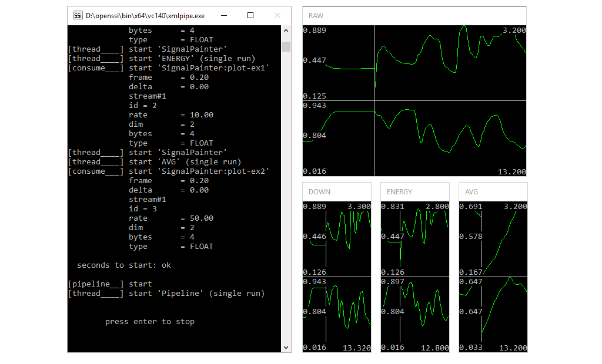{#fig:xml-basics-transformer width=80%}

> Check out the full [pipeline](code/xml/basics/transformer.pipeline).

#### In-place {#xml-basics-transformer-inplace}

If we manipulate a stream on-the-fly we call it an *in-place* manipulation. In that case the result of the transformation is not stored in a buffer, but directly handed over to a component. Only consumers and sensors support in-place manipulation, and in the latter case only filter components are allowed. For instance, we can remove the y coordinate from the cursor position by adding a ``Selector`` (from the ``frame`` plugin-in) to the channel where the cursor stream is created:

``` xml
<sensor create="Mouse:mouse" option="mouse" sr="50.0" mask="1">		
	<output channel="cursor" pin="pos">
		<transformer create="Selector" indices="0"/>
	</output>
</sensor>
```

Likewise, we can bind a 'MvgAvgVar' to the input of a ``SignalPainter``, which has the same effect as connecting it to the output pin of a regular transformer. However, other components in the pipeline cannot access the transformed signal any more.

``` xml
<consumer create="SignalPainter:plot" title="AVG" size="10.0">
	<input pin="pos" frame="0.2s">
		<transformer create="MvgAvgVar" win="5.0" format="1"/>
	</input>		
</consumer>	
```

> Check out the full [pipeline](code/xml/basics/transformer_inplace.pipeline).

#### Chain {#xml-basics-transformer-chain}

A ``Chain`` bundles multiple transformer in a single component. More precisely, an input stream first passes a number of filter steps, which are applied in-series, i.e. the output of the first filter servers as input for the second filter and so on. The output of the last filter operation is then forwarded to each feature component and results are concatenated. Like in the case of [in-place](#xml-basics-transformer-inplace) transformations intermediate results are not stored. The filter/feature components are defined in a xml file (ending on ``.chain``) and will be applied in order of occurrence, e.g.:

``` xml
<chain>
	<filter>
		<item create="Selector" indices="0" />
	</filter>
	<feature>		
		<item create="Functionals" names="min,mean,max" />
		<item create="Energy" />
	</feature>
</chain>
```

Here, ``Selector`` is used to select the first dimension of the input stream. Afterwards for each frame ``Functionals`` extracts the minimum, mean and maximum value and ``Energy`` the energy. Yet, we only add a single component to the pipeline:

``` xml
<transformer create="Chain" path="transformer_chain">
	<input pin="cursor" frame="0.2s" delta="0.8s"/>
	<output pin="chain"/>
</transformer>	
```

> Check out the full [pipeline](code/xml/basics/transformer_chain.pipeline) and the chain [definition](code/xml/basics/transformer_chain.chain).

### Events {#xml-basics-events}

So far we have exclusively worked with streams. Previously, we have introduced [events](#basics-pipelines-events) as the counterpart to streams. Unlike streams they represent any sort of information that is not generated in a continuous manner. For instance, we can tell our ``Mouse`` component to send an event each time the left mouse button is pressed or released by setting the option ``event="true"``:

``` xml
<sensor create="Mouse:mouse" sr="50.0" mask="1" event="true" address="click@button">		
	<output channel="cursor" pin="pos" />
</sensor>
```

We also assign an address to the event, where the first part of the address describes the event and the second part the sender (e.g. ``click@mouse``). Since a consumer (other than a transformer) does not have an output stream, it is possible to trigger it by events, i.e. it will only receive input when an event was fired. To do so, we replace the ``frame`` attribute with the ``address`` of our event. When an event with a matching address is fired,  our ``SignalPainter`` will receive a stream, which corresponds to the time slot represented by the event (defined by a start time and a duration in milliseconds):

``` xml
<consumer create="SignalPainter:plot" title="CURSOR">
	<input pin="pos" address="click@button" state="completed"/>		
</consumer>		
```

Note that we have removed the ``size`` option since now we want to display the received stream in its full length. And we set the input attribute ``state`` to filter out incomplete events, which is useful because the ``Mouse`` component will actually send two different events: one when the button is pressed down for the first time. This event gets a 0 duration and a ``continued`` state. And a second event when the button is released again. This event gets a duration equal to the elapsed time since the button was pressed down for the first time and a ``completed`` state.

The events sent by the ``Mouse`` component are *empty events*. Except for a state identifier, a start time and a duration (both in milliseconds), empty events do not carry additional information. However, there are other types of events that do so. As the name implies, *string events* have a (null terminated) string attached. The component ``StringEventSender`` creates string events by converting a stream into a string representation:

``` xml
<consumer create="StringEventSender" address="mean@string">
	<input pin="pos" address="click@mouse"/>
</consumer>
```

If the incoming stream contains more than a single sample, for each dimension the mean value is calculated (unless option ``mean`` is set to false) and the values are stringed together. The component ``TupleEventSender`` does the same, but without converting the values to a string:

``` xml
<consumer create="TupleEventSender" address="mean@tuple">
	<input pin="pos" address="click@mouse"/>
</consumer>
```

Finally, the component ``MapEventSender`` allows it to assign an identifier to each dimension, i.e. each dimension in the input stream is converted into a key-value pair (here the dimensions of the cursor position are named ``x`` and ``y``):

``` xml
<consumer create="MapEventSender" keys="x,y" address="mean@map">
	<input pin="pos" address="click@mouse"/>
</consumer>
```	

To monitor when events are created, the component ``EventMonitor`` displays a list of events within a certain time span. The time span can be given in seconds (trailing ``s``) or milliseconds (integer value or trailing ``ms``):

``` xml
<object create="EventMonitor:monitor" title="CURSOR">
	<listen address="@" span="10.0s" />		
</object>
```		

Note that the address is set to ``mean@``, which has the effect that the according component will receive events with name ``mean`` independent of the sender. Likewise, it is also possible to receive all events with certain sender names (``@<sender1>,<sender2>,...``). Of course any combination of event and sender names is possible, too, i.e. ``<event1>,<event2>,...@<sender1>,<sender2>,...``. To receive all events put ``@``. Once more we use the ``Decorator`` component to define where the window (with id ``monitor``) will be go on the screen.

``` xml
<object create="Decorator" icon="true" title="Pipeline">
	<area pos="0,0,400,600">console</area>
	<area pos="400,0,400,300">plot</area>
	<area pos="400,300,400,300">monitor</area>
</object>
```

{#fig:xml-basics-events width=80%}

> Check out the full [pipeline](code/xml/basics/events.pipeline).

## Advanced Concepts {#xml-advanced}

This chapter covers advanced topics about XML pipelines.

### More Tags {#xml-advanced-tags-variables}

Some additional tags to make life easier.

#### Variables {#xml-advanced-tags-variables}

Sometimes, it is clearer to outsource important options of an XML pipeline to a separate file. In the pipeline we mark those parts with ``$(<key>)``. A configuration file then includes statements of the form ``<key>`` = ``<value>``. For instance, we can assign a variable to the sample rate option:

``` xml
<sensor create="Mouse" sr="$(mouse:sr)">
  <provider channel="cursor" pin="pos"/>
</sensor>
```

and define the value in a separate file (configuration):

``` bash
mouse:sr = 50.0  # sample rate
```

Configuration files have the file ending ``.pipeline-config`` and can include an arbitrary number of variables (one per line). A configuration file which has the same name and is in the same folder as a pipeline is a *local* configuration file and implicitly applied when the according pipeline is started. However, the values defined in a *local* pipeline are possibly overwritten if one or more *global* configuration files are passed.

```
xmlpipe -config global1;global2 my
```

Here we call a pipeline with name ``my.pipeline``. First, global configuration files will be applied in the order given by the string, i.e. ``global1.pipeline-config`` followed by ``global2.pipeline-config``. As soon as a matching key is found its value is applied and can no longer be overwritten by following configuration files. After applying all global configuration files, remaining variables are replaced if a local configuration file (``my.pipeline-config``) exists. To make sure every key is assigned a value, you would usually want to a local configuration file, which assigns a default value to every variable. Global configuration files, on the other hand, are often used for fine-tuning to choose among different configurations.

To know how the pipeline looks after the configuration files were applied we can call ``xmlpipe`` with the option ``save``, which creates a file ``<path>.pipeline~``, e.g.:

```
xmlpipe -save -config global1;global2 my
```

For convenience, on Windows the tool ``xmlpipeui`` comes with a graphical interface, which lists variables and allows automated parsing of all keys from a pipeline. Via drop-down one can quickly switch between available pipelines/configuration files and run them right off as we see [here](#fig:xml-advanced-tags-variables).

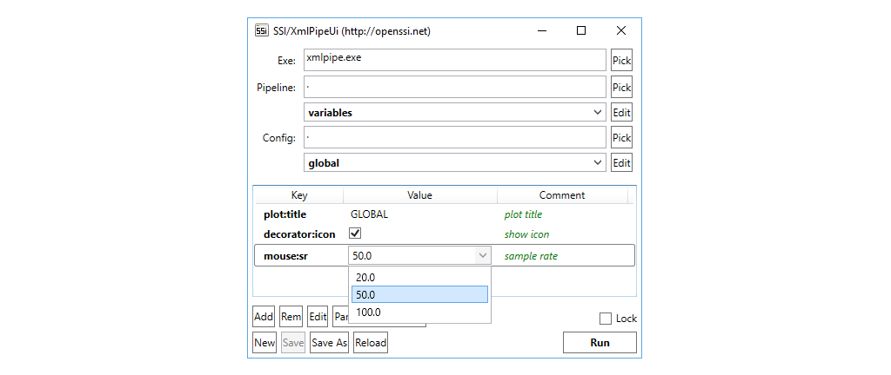{#fig:xml-advanced-tags-variables width=80%}

To assign a checkbox or a drop-down menu to a variable one has to add the ``$(bool)`` or ``$(select)`` keyword in a comment after the key/value pair, e.g.:

``` bash
decorator:icon = true # $(bool) show icon
mouse:sr = 50.0 # $(select{20.0,50.0,100.0}) sample rate
``` 

By default ``xmlpipe.exe`` will be searched in the same folder as the ``xmlpipeui.exe`` or if it is not found in the system path (``%PATH%``). The default path, however, can be changed in the GUI (``Pick`` button) or by creating a file ``xmlpipeui.ini``. The latter also allows it to set alternate search paths for pipeline and configuration files.

``` bash
[exe]
# path to executable
path = bin\xmlpipe.exe

[pipe]
# search path for pipelines
path = .

[config]
# search path for config files
path = .
``` 

Note that The variable ``$(date)`` is reserved and will be replaced with a time-stamp in the format ``yyyy-mm-dd_hh-mm-ss`` that stores when the pipeline was started.

> Check out the full [pipeline](code/xml/variables/my.pipeline) with a corresponding [local](code/xml/variables/my.pipeline-config) and [global](code/xml/variables/global.pipeline-config) configuration file.

#### Inclusion {#xml-advanced-tags-inclusion}

For the sake of clarity we sometimes want to split a long pipeline in several smaller pipelines. The ``include`` element is available for this purpose:

``` xml
<include path="<path-to-another-pipeline>"/>
```

We call a pipeline that is included by another pipeline a *child* pipeline. A child pipeline has access to all pins the *parent *pipeline has been created before the inclusion. After the inclusion a parent pipeline has access to all pins defined by the child. This also counts for plug-ins, i.e. a plug-in loaded by the parent is available to the child and if the child pipeline loads a plug-in it is afterwards available to the parent. If a child pipeline is not in the same directory as the parent pipeline the working directory is temporarily moved to the directory of the child pipeline.

Note that global configuration files will be passed from the parent pipeline to the child pipeline. If the parent has a local configuration file, however, it will not apply to its children. Of course, children can have their own local configuration files, which will be applied after all global configuration files have been processed.

Finally, think of the case where we have to alternate pipelines ``A`` and ``B`` and we either want to include ``A`` or ``B``. An elegant way to implement this is by defining a variable ``$(useA)`` in combination with two ``<gate>`` elements:

``` xml
<gate open="$(useA)">
	<include path="A"/>
</gate>	
<gate close="$(useA)">
	<include path="B"/>
</gate>
```

#### Scripts {#xml-advanced-tags-scripts}

To run external scripts we use:

``` xml
<job path="<path>" args="<args>" when="<when>" wait="<wait>"/>
```

* ``path``: the path to the script.
* ``args``: a list of optional scripts arguments separated by blanks.
* ``when``: defines when the script is executed, ``now`` will execute the script immediately (default), ``pre`` before the pipeline is started and ``post`` after the pipeline has been stopped.
* ``wait``: a value ``< 0`` will halt the pipeline until the job is finished (default), otherwise the pipeline will halt for ``n`` seconds and continue.

Some examples:

``` xml
<job path="job.cmd" args="arg1 arg2" when="pre" wait="-1"/>
```

executes script ``job.cmd`` with arguments ``arg1 arg2`` before the pipeline is started and waits until the job is finished.

``` xml
<job path="job.cmd" args="" when="post" wait="-1"/>
```
	
executes script ``job.cmd`` with no arguments after the pipeline was stopped and waits until job is finished.

``` xml
<job path="job.cmd" args="" when="now" wait="2000"/>
```

immediately executes script ``job.cmd`` with no arguments and halts pipeline for 2 seconds (afterwards pipeline continues even if the job is not finished yet).

### Network {#xml-advanced-network}

Complex systems may require it to spread processing on several machines. If the machines are connected in a network it is possible to synchronize their behaviour and even share data between them.

#### Synchronization {#xml-advanced-network-synchronization}

To synchronize multiple pipelines one pipeline becomes the server and sends a notification to its clients (all other pipelines).

To turn a pipeline into a server we add the line:

``` xml
<framework sync="true" slisten="false" sport="1111" sdialog="true"/>
```

And to set up a client, we add:

``` xml
<framework sync="true" slisten="true" sport="1111"/>
```

We now start the server and the client pipelines (if ``sdialog=false`` we should start the clients first, otherwise the order is not important) and wait until all clients show message:

```
        waiting for sync message to start
```

On the server side we should see a dialogue:

```
[0] QUIT
[1] RUN & QUIT
[2] RUN & RESTART
>
```

We choose a configuration and press enter. The server now sends a message to the clients and the processing starts simultaneously on all connected machines. If we select ``0`` clients will stop immediately. Otherwise processing runs until a stop signal is sent. In case of ``1`` pipelines will then quit. Otherwise (if ``2`` is selected) client pipelines go back into a waiting state and the server shows the dialogue one again.

To start clients from an external application a string message must be sent to the sync port (default protocol is UDP); a second message stops the pipeline. The format of the message is as follows:

``SSI:<type>:<id>\0``

To send a start message replace ``<type>`` with ``STRT``. To send a stop message set ``type`` to ``STOP``. Valid values for ``<id>`` are:

----------------------------------------------------------------------------
Id		  Description
--------- ----------------------------------------------------------------
``QUIT``  Quits pipeline immediately.

``RUN1``  Runs the pipeline exactly one time, then quits.

``RUNN``  Runs the pipeline and afterwards goes back into waiting state 
          (i.e. waits for another start message).
----------------------------------------------------------------------------

The following example shows how to start and stop a pipeline with Python:

``` python
import socket

UDP_IP = "127.0.0.1"
UDP_PORT = 1111
sock = socket.socket(socket.AF_INET, socket.SOCK_DGRAM)

input("\n\tpress enter to start pipeline\n")

MESSAGE = "SSI:STRT:RUN1\0"
sock.sendto(bytes(MESSAGE, "utf-8"), (UDP_IP, UDP_PORT))

input("\n\tpress enter to stop pipeline\n")

MESSAGE = "SSI:STOP:RUN1\0"
sock.sendto(bytes(MESSAGE, "utf-8"), (UDP_IP, UDP_PORT))
```

#### Stream and Event Sharing {#xml-advanced-network-sharing}

To share a stream between two pipelines we use ``StreamWriter`` and ``StreamReader`` (from the ``ioput`` plug-in). The sender connects the ``StreamWriter`` with the pin of the stream it wants to share and sets a port, as well as the host of the receiving machines:

``` xml
<consumer create="SocketWriter" port="2222" host="127.0.0.1">
	<input pin="cursor" frame="0.2s" />
</consumer>
```

The receiver adds the ``StreamReader`` and listens to port set by the sender. It is also necessary to describe the incoming stream (we have to allocate an appropriate buffer before the actual streaming starts):

``` xml
<sensor create="SocketReader" port="2222" ssr="50.0" sdim="2" sbyte="4" stype="9">		
	<output channel="socket" pin="cursor"/>
</sensor>
```

In a similar way we share can events by setting up a sender:

``` xml
<object create="SocketEventWriter" port="3333" osc="true" host="127.0.0.1">
	<listen address="click@button"/>
</object>		
```

and a receiver:

``` xml
<object create="SocketEventReader" port="3333" osc="true" address="event@button"/>	
```		

> Check out the [server](code/xml/network/server.pipeline) and the [client](code/xml/network/client.pipeline).

#### XML Sender {#xml-advanced-network-xmlsender}

An interesting way of sharing data with external applications allows the component ``XMLEventSender`` from the ``event`` plug-in. It offers a high level of flexibility as it does not prescribe a fixed format (except for a valid XML structure). Instead it takes a template and fills it at run-time with input from the pipeline. 
		
To access data in the template file we first connect according streams and events to ``XMLEventSender``, e.g.:

``` xml
<consumer create="XMLEventSender:monitor" path="xmlsender" address="ssi@xml" monitor="true">
	<input pin="cursor;button" frame="5"/>
	<listen address="@mouse"/>
</consumer>
```
gives access to two streams (``button`` and ``cursor``) and events with the sender name ``mouse``. The template is defined in a file ```xmlsender.xml```. To address streams and events in the template we use variables in the form ``$(x)`` and replace ``x`` either with the index of a stream (counting from 0) or an event address (i.e. ``<name>@<sender>``), e.g.:

``` xml
<mouse>    
	<cursor>$(0)</cursor>
	<button>$(1)</button>
	<event>$(button@mouse)</event>
</mouse>
```

generates the following [output](#fig:xml-advanced-network-xmlsender-0):

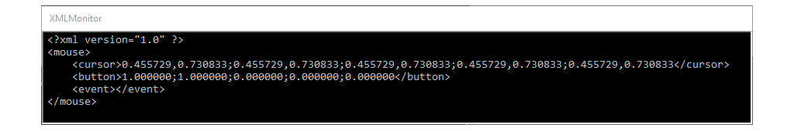{#fig:xml-advanced-network-xmlsender-0 width=80%}

We see that ``$(0)`` and ``$(1)`` are replaced with samples of the according streams and ``$(button@mouse)`` with an empty string. Since empty events carry no additional information that could be displayed, we insert an additional component that calculates the mean, minimum and maximum value of the cursor position and publishes them as a new event ```features@mouse``` (actually a [map event](#xml-basics-events)):

``` xml
<consumer create="FunctionalsEventSender" names="mean,min,max" address="features@mouse">
	<input pin="cursor" address="click@mouse"/>
</consumer>
```

By adding options to the variable (``$(x{options}``) we can further influence how the inserted information is displayed, e.g.:

``` xml
<mouse>    
	<cursor x="$(0{select=0;functional=mean})" y="$(0{select=1;functional=mean})"/>
	<button>$(1{functional=max;precision=0})</button>
	<features>$(features@mouse)</features>	
</mouse>
```

generates the following [output](#fig:xml-advanced-network-xmlsender-1):

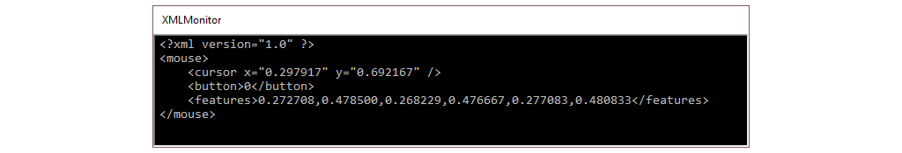{#fig:xml-advanced-network-xmlsender-1 width=80%}

For instance, the option ``select=0`` picks the first stream dimension of the stream and adding ``function=mean`` replaces a sequence of samples by their mean value. 

Options that apply to streams and tuple/map events:

----------------------------------------------------------------------------
Example						Description
--------------------------	------------------------------------------------
``select=0``				Selects the first dimension.

``select=1,3``				Selects the second and fourth dimension.

``select=1-3``				Selects the second, third and fourth dimension.

``select*2=1``				Selects every second dimension starting from 
							the first dimension.
							
``precision=2``				Displays two decimal places.

``precision=0``				Omits decimal places.
----------------------------------------------------------------------------
\
Options that apply to streams only:

----------------------------------------------------------------------------
Example						Description
--------------------------	------------------------------------------------
``function=mean``			Calculates mean value.

``function=std``			Calculates standard deviation.

``function=min``			Calculates minimum.

``function=max``			Calculates maximum.

``function=first``			Select first sample (latest).

``function=last``			Select last sample (oldest).
----------------------------------------------------------------------------
\
Options that apply to events only:

----------------------------------------------------------------------------
Example						Description
--------------------------	------------------------------------------------
``field=time``				Event start time relative to start of pipeline 
							(in milliseconds).

``field=time_system``		Event start time relative to start of system 
							(in milliseconds).

``field=time_relative``		Elapsed time since event was started (relative 
							to current time stamp in milliseconds).

``field=duration``			Event duration (in milliseconds).	

``field=event``				Event name.

``field=sender``			Sender name.

``field=state``				Event state (0=completed, 1=continued).

``field=name``				Event key (map events only).

``span=1000``				Remove event after 1000 ms (if no new event arrives).
----------------------------------------------------------------------------
\
To share the xml string with an external application, we use ``SocketEventWriter`` with option ``xml=true``:

``` xml
<object create="SocketEventWriter" port="2222" type="0" xml="true">
	<listen address="ssi@xml"/>
</object>
```	

> Check out the full [pipeline](code/xml/network/xmlsender.pipeline) and the according [template](code/xml/network/xmlsender.xml).
		
### Options {#xml-advanced-options}		
		
So far, we have learned about [options](#xml-basics-component) as a way to configure the behaviour of a component before the execution of a pipeline. However, some options also allow it to change the behaviour of a component *at* run-time. We can read this from the API when an option is marked as ``FREE`` (see [here](#fig:xml-advanced-options-0)).

{#fig:xml-advanced-options-0 width=80%}

First, we add an instance of ``Limits``, which keeps stream values in a certain range. The range is defined by options ``min`` and ``max``, which we initialize with default values:

``` xml
<transformer create="Limits:limits" min="0.0" max="1.0">
	<input pin="pos" frame="0.2s"/>
	<output pin="pos-lim"/>
</transformer>
```

Now, we need a way to access the ``min`` and ``max`` options at run-time. The ``ControlGid`` from the ``control`` plug-in does exactly that. We set the ``id`` of the controller to our limiter (to target multiple components we separate their ids by ',' or use the '*' operator):

``` xml
<runnable create="ControlGrid:control" id="limits"/>	
``` 

When the pipeline is started editable options are listed and can be changed (press enter to confirm) as shown [here](#fig:xml-advanced-options-1). Note that we used the ``runnable`` tag to include the component. We do this because GUI elements have 	their own thread and this way we make sure it will be started.

{#fig:xml-advanced-options-1 width=80%}

To target a specific option we can use ``ControlTextBox``:

``` xml
<runnable create="ControlTextBox:control" id="limits" name="min"/>
<runnable create="ControlTextBox:control" id="limits" name="max"/>
``` 

It gives us an individual text box for each option as shown [here](#fig:xml-advanced-options-2):

{#fig:xml-advanced-options-2 width=80%}

Or in case of a floating point option (single value) we can use ``ControlSlider``:

``` xml
<runnable create="ControlSlider:control" id="limits" name="min" defval="0.0" minval="0.0" maxval="0.5"/>
<runnable create="ControlSlider:control" id="limits" name="max" defval="0.5" minval="0.5" maxval="1.0"/>
```

It creates a slider for each option as shown [here](#fig:xml-advanced-options-3):

{#fig:xml-advanced-options-3 width=80%}

> Check out the full code: [controller](code/xml/options/controller.pipeline), [textbox](code/xml/options/textbox.pipeline), [slider](code/xml/options/slider.pipeline).

# Python {#python}

SSI allows it to develop new components with [Python](https://www.Python.org/). If the aim is to write extensions to SSI without having to use Visual Studio or some other C++ developing environment Python is a good choice. In this chapter we will learn how to write and use Python components in SSI.

## Components {#python-components}

In SSI a Python component is basically a collection of functions, which are called in a certain order. When SSI reads in a Python script it looks which of the relevant functions are available (some functions are optional, while others are mandatory). For instance, the function ``getSampleDimensionOut(...)`` will be called to determine the number of dimensions in an output stream. The name of the functions and the number of parameters are fixed. A misspelled function is simply not recognized, whereas an incorrect number of parameters causes an error at run-time. To use a Python script in a (XML) pipeline a wrapper component is interposed, e.g.:

``` xml
<consumer create="PythonConsumer" script="ssi_print" syspath=".;my/scripts">
	<input pin="cursor" frame="1.0s"/>
</consumer>
```

will call functions from the script ``ssi_print.py``. The attribute ``syspath`` is used to add directories to the system path of Python (by default set to the working directory). In the following we will see each [component](#basics-component) (sensor, transformer, ...) has a specific wrapper and uses a different set of functions. 

The general syntax of a function in Python is:

``` Python
def function_name([param1, param2, ...]):  
```

As a dynamic type language the type of a parameter in Python (like every object) is not specified at compile time. Yet, it is important to have in mind which type an object has since this determines the context in which it can be used. For instance, we can call the method ``count()`` on a ``tuple`` object, but not on a ``set`` object. SSI introduces a couple of new [types] with specific methods and attributes.

> Though, it is possible to use multiple Python components in a single pipeline and even different instances of the same component, one should keep in mind that it is generally not possible to execute Python byte-code from multiple native threads with the consequence that SSI components, even though they run in separate threads, have to get Python's global interpreter lock (GIL) to execute Python code. This means that only one component can actually execute Python code at a time. Hence, using many Python components in a single pipeline may turn into a bottleneck.

## Types {#python-types}

To represent streams in Python a new type ``ssipystream`` is introduced. Its accessible fields and methods are:

* **num** [*int*]: Number of samples
* **dim** [*int*]: Number of dimensions
* **len** [*int*]: Number of values
* **tot** [*int*]: Total number of bytes
* **byte** [*int*]: Number of bytes per value
* **type** [*int*]: Type code (see below)
* **sr** [*double*]: Sample rate in hz
* **time** [*double*]: Time stamp in seconds
* **length()** [return *int*]: Returns the number of values
* **shape()** [return (*int*,*int*)]: Returns the shape (num x dim)
* **type()** [return *string*] Returns the type string identifier (see below)

The ``type`` field defines the type of a sample values. An enumeration of valid types is defined in ``ssipystreamtype``. Each type also has a code and a string representation:

------------------------------------------------------------------
Code  Type        String  Bytes  Description
----- ----------- ------- ------ ---------------------------------
1     ``CHAR``      'b'     1      signed integer (character)

2     ``UCHAR``     'B'     1      unsigned integer (character)

3     ``SHORT``     'h'     2      signed integer (short)

4     ``USHORT``    'H'     2      unsigned integer (short)

5     ``INT``       'i'     4      signed integer

6     ``UINT``      'I'     4      unsigned integer

7     ``LONG``      'k'     8      signed integer (long)

8     ``ULONG``     'K'     8      unsigned integer (long)

9     ``FLOAT``     'f'     4      floating point number (float)

10    ``DOUBLE``    'd'     8      floating point number (double)
------------------------------------------------------------------
\
To access the n'th value of a stream we write:

``` Python
value = stream[n]
```

To access all values one by one we can use an interator:

``` Python
for s in stream:
	print(s)
```

To access the m'th dimension value of the n'th samples we write:

``` Python
value = stream[n,m]
```

Hence, another way to access every value is:

``` Python
for n in range(stream.num):
	for d in range(stream.dim):		
		print(stream[n,d])
```

To print a stream we write:

``` Python
print (stream)
```

To represent an image the type ``ssipyimage`` is introduces. Its attributes and methods are:

* **width** [*int*]: Width in pixels
* **height** [*int*]: Height in pixels
* **channels** [*int*]: Number of channels per pixel
* **depth** [*int*]: Number of bytes per channel
* **stride** [*int*]: Stride in bytes (i.e. number of bytes per row)
* **tot** [*int*]: Total number of bytes
* **sr** [*double*]: Sample rate in hz
* **time** [*double*]: Time stamp in seconds
* **pixel()** [return *int*]: Returns the number of pixels
* **size()** [return *int*]: Returns the number of pixel values
* **shape()** [return (*int*,*int*,*int*)] Returns the shape of the image (height x width x channels)

To describe just the image format the type ``ssiptyimageparams`` is available:

* **width** [*int*]: Width in pixels
* **height** [*int*]: Height in pixels
* **channels** [*int*]: Number of channels per pixel
* **depth** [*int*]: Number of bytes per channel

Other than streams it is not possible to access single pixel values. However, both - streams and images - can be converted into NumPy matrices/arrays (requires [numpy](http://www.numpy.org/numpy), see [installation](#installation)):

``` Python
npmat = numpy.asmatrix(stream) 
npimg = numpy.asarray(image)
```
 
Since NumPy offers an assortment of routines for fast scientific computing it should be the preferred way to work with streams/images. Both, ``asmatrix()`` and ``asarray()``, borrow the memory and hence allow it to work directly on memory allocated by SSI. 

The remaining types are (will be explained at the appropriate place):

``ssipyinfo``:

* **time** [*double*]: Time in seconds
* **dur** [*double*]: Duration in seconds
* **frame** [*int*]: Number of new frames
* **delta** [*int*]: Number of overlapping frames

``ssipychannel``:

* **dim** [*int*]: Number of dimensions
* **byte** [*int*]: Number of bytes per value
* **type** [*int*]: Type code
* **sr** [*double*]: Sample rate in hz

``ssipyevent``:

* **time** [*int*]: Time in milliseconds
* **dur** [*int*]: Duration in milliseconds
* **address** [*string*]: Address <event@sender>
* **state** [*int*]: Event state (0=completed, 1=continued)
* **glue** [*int*]: Glue id (to mark events that belong to each other)
* **prob** [*int*]: Confidence value
* **data** [*object*]: Data object (e.g. a list or a dictionary)

``ssipyeventboard``:

* **COMPLETED** [*int*]: 0
* **CONTINUED** [*int*]: 1
* **update()** [arguments: time:*int*, duration:*int*, address:*string*, data:*object*]: Sends an event

## Options and Variables {#python-options}

A Python component can define options and variables. As discussed [earlier](#xml-basics-component) options give us the possibility to tune a component, whereas variables are used to store data between successive function calls. To initialize options and variables we include a function ``getOptions()`` to our Python script:

``` Python
def getOptions(opts, vars):

    opts['path'] = 'foo.abc'
	opts['pi'] = 3.142
	
	vars['x'] = 0
	vars['arr'] = (1,2,3)
```
	
If it exists ``getOptions()`` is the first function that is called (even if it not the first function defined in the script - the order of the functions is not relevant). Two dictionaries ``opts`` and ``vars`` (though their names can be different) are passed as arguments. In Python a dictionary is an associative array (also known as hashes), which elements are accessed via keys. In the following the two dictionaries will be passed to each function and allow it to save information between function calls. However, here we have the possibility to initialize them in the first place. 

While variables are only meant for internal use, options can be accessed and overwritten from outside (e.g. in the XML pipeline). Therefore the wrapper provides an option ``optsstr``, which can be used to assign existing options with new values (note that it is not possible to introduce new options that way). For instance, we can assign ``optsstr="path=my.abc;pi=3.14159"`` to override the default values of the options given above. Alternatively, we can provide a file through the option ``optsfile``:

```
path = foo.abc
pi = 3.14159
```

However, options defined in ``optsstr`` will still overwrite options given by file. 

## Sensor {#python-sensor}

We want to create a [sensor](#basics-pipelines-components) that generates sine and saw waves. Sample rate and dimension of the streams can be set by the user, so we implement ``getOptions()``:

``` Python
def getOptions(opts, vars):
    opts['sr'] = 10.0
    opts['dim'] = 1
```

Next, we implement ``getChannelNames()`` to define the channels names:

``` Python
def getChannelNames(opts, vars):
    return {'saw':'a saw wave', 
            'sine':'a sine wave'}
```

The function returns a dictionary with pairs of strings. Each pair defines a channel name (key) and adds a description (value). Now, we need to describe the channel streams, which we do by adding a function ``initChannel()``:

``` Python
def initChannel(name, channel, types, opts, vars):
    if name == 'saw':
        channel.dim =  opts['dim']
        channel.type = types.FLOAT
        channel.sr = opts['sr']
    elif name == 'sine':
        channel.dim = opts['dim']
        channel.type = types.FLOAT
        channel.sr = opts['sr']
    else:
        print('unkown channel name')
```

Here, we use the options defined earlier to set the sample rate and the number dimension. As type we choose ``FLOAT`` (the number of bytes per value are automatically set depending on the type). 

Next, a function named ``connect()`` is called. It is the appropriate place to do further initialization steps, e.g. to call driver functions on the sensor. Since we do not connect a physical sensor we simply pass on (we could also omit the function):

``` Python
def connect(opts, vars):
    pass
```

Now, SSI will continuously call the ``read()`` function:

``` Python     
def read(name, sout, reset, board, opts, vars):    

    time = sout.time
    delta = 1.0 / sout.sr

    if name == 'saw':
        for n in range(sout.num):
            for d in range(sout.dim):
                sout[n,d] = time - math.floor(time)
            time += delta

    elif name == 'sine':
        for n in range(sout.num):
            for d in range(sout.dim):
                sout[n,d] = math.sin(2*math.pi*time)
            time += delta

    else:
        print('unkown channel name')
```

The first two arguments are the channel name and the output stream, which is pre-allocated and to be filled by the function. The third argument ``reset`` will be 1 as long as the pipeline has not been started and 0 afterwards. For instance, if we read from a file we should re-send the first chunk as long as ``reset`` is 1. Since we use the current time stamp (elapsed time since pipeline was started) we do not have to consider the flag. To generate the sine/saw values we use two nested ``for`` loops. The outer loop iterate over all samples in the stream and increments the time stamp by the duration of a single sample (1 divided by the sample rate). The inner loop iterates over the number of dimensions and assigns the current sample values to each dimension. The function has three more arguments: The first is ``board`` and allows it to send events to SSI, which will be explained [later](#python-events). The last two arguments are the dictionaries containing options and variables as discussed [before](#python-options).

Finally, the function ``disconnect()`` is called after the pipeline was stopped and allows it to do some clean up. Again, we simply pass on (or omit):

``` Python
def disconnect(opts, vars):
    pass
```

To use an instance of our sensor in an [XML pipeline](#xml-basics) we use the [sensor](#xml-basics-sensor) tag:

``` xml
<sensor create="PythonSensor" script="sensor" block="0.1" optsstr="sr=50.0;dim=2">
	<output channel="sine" pin="sine"/>
	<output channel="saw" pin="saw"/>
</sensor>
```

We use the option ``optsstr`` to overwrite the default values for the sample rate and the number of dimensions. And we set the option ``block`` to 0.1 seconds, which defines the interval in which ``read()`` will be called.

> Check out the Python [script](code/python/sensor.py) and the according [pipeline](code/python/sensor.pipeline).

## Consumer {#python-consumer}

To implement a [consumer](#basics-pipelines-components) we add a function ``consume()``, e.g.:

``` Python
def consume(info, sin, board, opts, vars): 
    for s in sin:
		print(sin[0])
```

Since a consumer may receive multiple streams we receive a ``tuple`` of streams. In Python a ``tuple`` represents a an immutable sequence of objects. This is appropriate since the number of streams will not change between successive calls. 

When ``consume()`` is called for the first time it will already deliver the first chunks of data. However, sometimes we would like to know how many streams and what kind of streams we will receive (e.g. to initialize temporal variables). To this end, we can add a function ``consume_enter()``, which is called once before the actual processing starts. Likewise, the function ``consume_flush()`` is called when the processing was stopped (e.g. to clean up). The following example uses the ``consume_enter`` and ``consume_flush`` to create and close a file. Note how the file pointer is stored in the variable dictionary.

``` Python
def consume_enter(sin, board, opts, vars):
    vars['fp'] = open('output.txt', 'w')
	
def consume(info, sin, board, opts, vars): 
    for s in sin:
        vars['fp'].write(str(s) + '\n')

def consume_flush(sin, board, opts, vars):
    vars['fp'].close()
```

> Check out the Python [script](code/python/consumer.py) and the according [pipeline](code/python/consumer.pipeline).

## Transformer {#python-transformer}

To determine the properties of the output stream of a [transformer](#basics-pipelines-components) several functions are called, each receiving the according property of the input stream as argument. The functions are:

``` Python
def getSampleNumberOut(num, opts, vars):
    return num

def getSampleDimensionOut(dim, opts, vars):
    return dim

def getSampleBytesOut(bytes, opts, vars):
    return bytes

def getSampleTypeOut(type, types, opts, vars):
    return type
```
	
Since by default a function returns the property of the input stream, we only have to add functions for properties that actually change. For instance, if a transformer reduces the sample rate by half, we would write:

``` Python
def getSampleNumberOut(num, opts, vars):
    return math.floor(num / 2)
```

Or to change the type from ``INT`` to ``FLOAT``:

``` Python
def getSampleTypeOut(type, types, opts, vars):
	if type != types.INT
		print('unexpected input type')
		return types.UNDEF
    return types.FLOAT
	
def getSampleBytesOut(bytes, opts, vars):
	return 4
```

As an example we will implement a filter and a feature [component](#basics-pipelines-components). To recap, a filter is a special kind of transformer that does not change the sample rate, whereas a feature reduces the input stream to a single sample.

### Filter {#python-transformer-filter}

The filter we want to implement sums up the values in all dimensions. Therefore we let the function ``getSampleDimension()`` return 1:
		
``` Python
def getSampleDimensionOut(dim, opts, vars):
    return 1	
```

When the pipeline is started, the function ``transform()`` is continuously called:
	
``` Python
def transform(info, sin, sout, sxtra, board, opts, vars):   
    for n in range(sin.num):
        sout[n] = 0
        for d in range(sin.dim):
            sout[n] += sin[n,d]
```

The first argument is a variable of type ``ssitypeinfo`` (see [here](#python-types)) including the current time stamp and duration in seconds, as well as, the number of frame and delta samples. The next two arguments are the input stream and the pre-allocated output stream. Additional streams are passed in a tuple ``sxtra`` followed by event board, options and variables. We use the outer loop to iterate over all samples and initialize the output sample with 0. The inner loop iterates over the dimensions and sums up the sample values.

With NumPy we can rewrite above statement as follows:

``` Python
def transform(info, sin, sout, sxtra, board, opts, vars):
	npin = numpy.asmatrix(sin)
	npout = numpy.asmatrix(sout)
	numpy.sum(npin, axis=1, out=npout)
```

Since NumPy is optimized to work with multi-dimensional arrays it can run almost as quickly as equivalent C code. Note that we use the argument ``out`` to prevent that a new array is created. Instead the result is directly written into the output stream.

> Check out the Python [script](code/python/filter.py) (NumPy [version](code/python/filter_np.py)) and the according [pipeline](code/python/filter.pipeline).

### Feature {#python-transformer-feature}

The feature we want to implement returns the energy in each dimension. Since this does not change the number of dimensions we do not need to implement ``getSampleDimensionOut()``. In fact, for our purpose it is sufficient to implement ``transform()``:

``` python
def transform(info, sin, sout, sxtra, board, opts, vars):   
    for d in range(sin.dim):
        sout[d] = 0
    for n in range(sin.num):
        for d in range(sin.dim):
            val = sin[n,d]
            sout[d] += val*val
    for d in range(sin.dim):
        sout[d] = math.sqrt(sout[d] / sin.num)  
```

The first loop initializes the output stream with zeros. Then we square the elements in the input stream and sum up samples per dimension. Finally, we take the square root on the output stream. 

Again, we can rewrite the code with NumPy to get a more compact (and more efficient) version:

``` python
def transform(info, sin, sout, sxtra, board, opts, vars):
    npin = numpy.asmatrix(sin)
    npout = numpy.asmatrix(sout)
    numpy.sum(npin, axis=0, out=npout)
    numpy.square(npout, out=npout)
    numpy.sqrt(npout, out=npout)
```

> Check out the Python [script](code/python/feature.py) (NumPy [version](code/python/feature_np.py)) and the according [pipeline](code/python/feature.pipeline).

## Events {#python-events} 

If we want to send [events](#basics-pipelines-events) from a Python component we should implement the function ``getEventAddress()``. It tells SSI the address(es) we are going to use:

``` python
def getEventAddress(opts, vars):
    return 'empty,string,tuple,map@python'
```

The variable ``eboard``, which has the [type](#python-types) ``ssipyeventboard``, provides a function ``update()``, which we call to send an event. It takes the start time and duration (in milliseconds), the event address and possibly an object to provide optional data. As explained [earlier](#xml-basics-events) SSI supports four types of events: ``EMPTY``, ``STRING``, ``TUPLE`` and ``MAP``. The event type is automatically determined from the provided data:

-----------------------------
Type        Data
----------- -----------------
``EMPTY``   None

``STRING``  String

``TUPLE``   Float/Tuple/List

``MAP``     Dictionary
-----------------------------
\
The following example shows all four versions. Note that we use a ``OrderedDict`` instead of a regular dictionary to make sure the keys are kept in the given order:

``` python
def send_enter(opts, vars):
    pass

def consume(info, sin, board, opts, vars): 

    npin = numpy.asmatrix(sin[0])
    mean = numpy.mean(npin, axis=0)

    time_ms = round(1000 * info.time)
    dur_ms = round(1000 * info.dur)
	
    board.update(time_ms, dur_ms, 'empty@python', state=board.COMPLETED)
    board.update(time_ms, dur_ms, 'string@python', str(mean));
    board.update(time_ms, dur_ms, 'tuple@python', (mean[0,0], mean[0,1]));
    board.update(time_ms, dur_ms, 'map@python', OrderedDict([('x',mean[0,0]), ('y',mean[0,1])]));
	
def send_flush(opts, vars):
    pass
```

By default the events are sent as completed events. We can manually set the state by setting the argument ``state``. Addionally, there are arguments ``glue`` and ``prob`` to overwrite the glue identifier and the confidence value. The functions ``send_enter()`` and ``send_flush()`` will be called once before the pipeline is started and after the pipeline was stopped. Note that we have to convert the time stamps provided in the ``info`` struct from seconds to milliseconds.

In the XML pipeline we use a ``PythonConsumer`` to connect the script with a input stream:

``` xml
<consumer create="PythonConsumer" script="events" syspath=".">
	<input pin="cursor" address="click@mouse"/>			
</consumer>
```

Of course, we can also receive events. Therefore we implement the function ``update()`` (``listen_enter()`` and ``listen_flush()`` are again optional):

``` python
def listen_enter(opts, vars):
    pass

def update(event, board, opts, vars):    
    print('time    = %d' %event.time)
    print('dur     = %d' %event.dur)
    print('address = %s' %event.address)    
    print('state   = %d' %event.state)
    print('glue    = %d' %event.glue)    
    print('data    = %s' %str(event.data))

def listen_flush(opts, vars):
    pass
```

In the XML pipeline we embed the script in a ``PythonObject`` and add the ``<listen/>`` tag to specify which events we would like to receive:

``` xml
<object create="PythonObject" script="events" syspath=".">		
	<listen address="@python"/>
</object>	
```

Note that we use a single script ``events.py`` for sending and receiving the events. Since a consumer can also receive events, we can also merge the two statements:

``` xml
<consumer create="PythonConsumer" script="events" syspath=".">
	<input pin="cursor" address="click@mouse"/>			
	<listen address="@python"/>	
</consumer>
```

The result is shown [here](#fig:python-events-0).

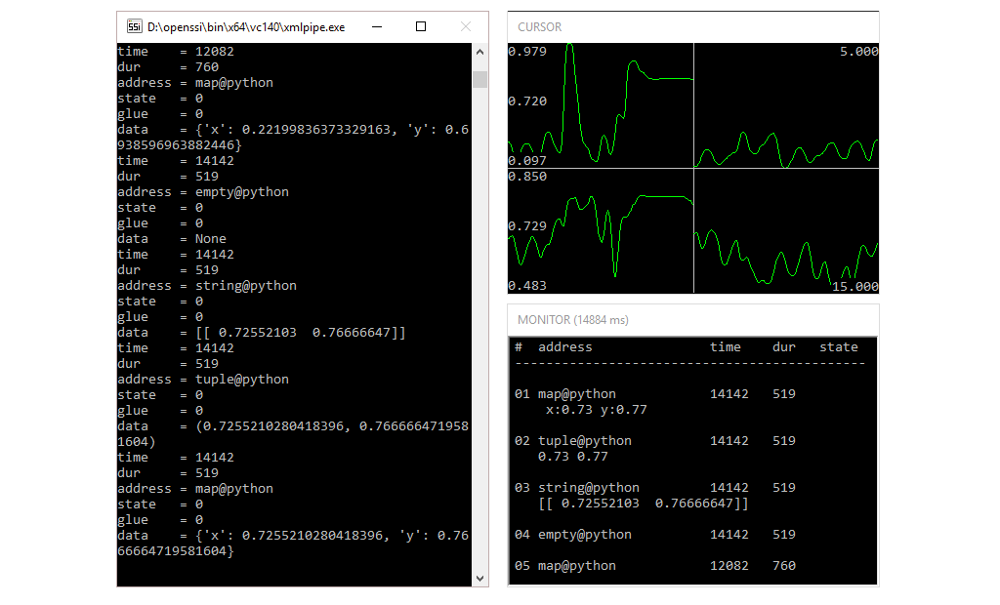{#fig:python-events-0 width=80%}

> Check out the Python [script](code/python/events.py) and the according [pipeline](code/python/events.pipeline).

## Image Processing

In SSI an image is seen as a single block of bytes (i.e. a video is a stream with a single dimension). However, naturally we want to represent an image as a three dimensional array defined by the number of horizontal pixels (columns or width), the number of vertical pixels (rows or height) and the number of channels. Therefore, the type [``ssipyimage``](#python-types) has been introduced along with a set of special wrappers, which ensure that the samples of an input stream are converted to images. Again, the best way to work with images is by converting them to a NumPy array:

``` python
img = numpy.asarray(stream)
```

Once converted into a NumPy array, we can do further processing using the popular image processing library [OpenCv](http://opencv.org/). For instance, to flip and display an image we write:

``` python
def consume(info, sin, board, opts, vars): 
    img = numpy.asarray(sin[0])
    cv2.flip(img, 0, img)
    cv2.imshow('mywindow', img)
    cv2.resizeWindow('mywindow', sin[0].width, sin[0].height)
    cv2.waitKey(1)
```

To know the properties of the image stream before ``consume()`` is called for the first time, we implement the function ``setImageFormatIn()``, which receives a variable of type [``ssipyimageparams``](#python-types):

``` python
def setImageFormatIn(format, opts, vars): 
    print(format)    
```

To use the script in a pipeline we first need an image source. The ``camera`` plug-in includes a sensor to connect video devices:

``` xml
<sensor create="Camera" option="camera">
	<output channel="video" pin="video" size="2.0s"/>
</sensor>
```

We can now connect the output of the camera to our script using ``PythonImageConsumer``:

``` xml
<consumer create="PythonImageConsumer" script="ssi_imgplot">
	<input pin="video" frame="1"/>
</consumer>
```

In the same way we can manipulate a video stream. For example, to convert the input images into gray-scale we write:

``` python
def transform(info, sin, sout, sxtra, board, opts, vars):   
    iin = numpy.asarray(sin)
    iout = numpy.asarray(sout)
    cv2.cvtColor(iin, cv2.COLOR_RGB2GRAY, iout)
```

However, since the output image is pre-allocated, we need to tell SSI that the dimension of the output image is 1. Therefore, we implement the function ``getImageFormatOut()``:

``` python
def getImageFormatOut(format, opts, vars): 
    format.channels = 1
    return format
```

To use the script in a pipeline we use ``PythonImageFilter``:

``` xml
<transformer create="PythonImageFilter" script="image_filter">
	<input pin="video" frame="1"/>
	<output pin="gray"/>
</transformer>
```

Finally, we can also extract features from an image and feed them back in the pipeline. For instance, we can calculate the mean value in each channel:

``` python
def setImageFormatIn(format, opts, vars): 
    vars['channels'] = format.channels

def getSampleDimensionOut(dim, opts, vars):
    return vars['channels']

def getSampleTypeOut(type, types, opts, vars):
    return types.FLOAT

def getSampleBytesOut(bytes, opts, vars):
    return 4
    
def transform(info, sin, sout, sxtra, board, opts, vars):   
    iin = numpy.asarray(sin)
    iout = numpy.reshape(sout, vars['channels'])
    iin.mean((0,1),out=iout)
```

Note, that once more we implement ``setImageFormatIn()`` to know how many channels we will receive. We need this information to return the correct number of output dimensions. To use the feature in a pipeline we add:

``` xml
<transformer create="PythonImageFeature" script="image_feature">
	<input pin="video" frame="1"/>
	<output pin="average"/>
</transformer>
```

> Check out the [pipeline](code/python/image.pipeline) and the according scripts: [consumer](code/python/image_consumer.py), [feature](code/python/image_feature.py), and , [filter](code/python/image_filter.py).

# C++

For the moment please refer to [this](tutorial/tutorial.pdf) document.