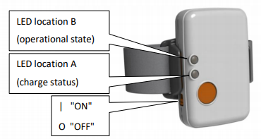
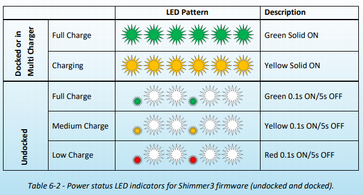
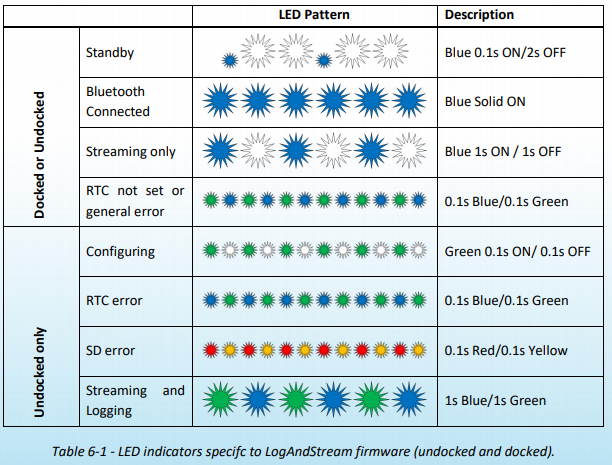

# Set up and usage of Shimmer3 GSR+ Set
Setup Guide for the Consesys GSR Development Kit (https://www.shimmersensing.com/products/gsr-optical-pulse-development-kit).

## Contents
1. [Package Content](#package-content)
2. [Basics](#basics)
3. [Software Installation and Setup](#software-installation-and-setup)
4. [Flashing firmware onto a Shimmer with the Consensys Software](#flashing-firmware-onto-a-shimmer-with-the-consensys-software)
5. [Configuring a Shimmer for a recording session](#configuring-a-shimmer-for-a-recording-session)
5. [Streaming data via blueetooth](#Streaming-data-via-blueetooth)
5. [What the LEDs on the Shimmer unit mean](#what-the-leds-on-the-shimmer-unit-mean)
5. [Info for SSI development](#info-for-SSI-development)

---

## Package Content:
* 2x Shimmer
* 2x Sensors for GSR and PPG measurements + Wristband
* 1x Base6 Station (charging and programming the Shimmers' firmware)
* Case, AC-Adapter, USB-cable, etc.

## Basics
The GSR Shimmers can measure Galvanic Skin Resistance via two electrodes, usually placed on the base of the fingers of the non-dominant hand. A PPG measurement unit is also included that can measure heart rate (or at least a signal from which HR can be calculated) by optical means. This probe is usually clipped to the earlobe or placed on the fingertip.

To work with the Shimmers they need to be programmed with Firmware, data logged onto their interal SD-Cards needs to be downloaded and they need to be charged. All of this is accomplished through the Base-Station and its companion software the ConsensysBasic or ConsensysPro (not free).

## Software Installation and Setup
> The following steps can also be found spread throughout about 20 slides in the `Consensys_User_Guide_rev1.6a.pdf` in this directory.

1. Download and install ConsensysBasic [Consensys V1.6.0 at the time of writing](https://www.shimmersensing.com/support/wireless-sensor-networks-download/).
2. Connect the Base to power
3. Connect the USB cable to the computer and then the base
4. Windows will do it's driver thing
5. Once that's done verify that the drivers were actually installed:
    - Win+R, then type `devmgmt.mcs` and Enter
    - This opens the device manager
    - Verify that there are `USB Serial Converter A (B, C, D as well)` und `Universal Serial Bus controllers`
    - If they are present, right click > Properties > Driver: make sure Driver Provider is FTDI and in the Advanced tab that `Load VCP` is enabled
    - If they are NOT present you must manually install the drivers:
        * Go to https://ftdichip.com/drivers/vcp-drivers/ and download the `setup executable` for Windows in the table on that page
        * Run that executable as Administrator
        * Once finished, you should now see the four `USB Serial Converter`s in the device manager
6. Open the Consensys Software
7. Click on `Device Management`, you should now see a picture of the empty base station
8. Turn on one of the Shimmer units and plug it into one of the slots on the base station

## Flashing firmware onto a Shimmer with the Consensys Software
1. If the Shimmer is on, turn it off
1. Place the Shimmer in the base, turn the Shimmer on -> wait for it to appear in the `Manage Devices` tab
2. In the bottom right there are buttons for:
    -  `Firmware` (Firmware flashing onto the Shimmer)
    -  `Configure` (Separate configuration which is also "flashed" onto the Shimmer)
    -  `Import` (Starting the import workflow for data recorded to the unit's SD card)
3. Press `Firmware`
4. Select the firmware you want to flash onto the device (go into the "other" tab if you have a file with custom firmware that you want to use)
5. Click `Programm` -> this will immediately open a new window and start flashing!
6. Once complete, click `Done`

## Configuring a Shimmer for a recording session
1. Select a Shimmer with the desired firmware installed and press `Configure`
5. In the top left, name the "Trial"
    >(each trial can and will have multiple "session" within it, where one session is a single uninterrupted recording)
5. Select whether to start immediately after undock (or power on if not in the base) or on button press on the shimmer
    >button press did not seem to work in a first test!
5. Set the Sampling Rate (supports up to 1024Hz but lower frequencies are recommended)
6. Select the sensors that should be active (ranges can be adjusted by clicking on the tiny numbers in the lower left corner of each sensor tile)
7. Once happy, press `Write Config` to flash it onto the Shimmer Unit
8. Now connect the probes to the Shimmer unit and take it out of the Base to start recording data

## Streaming data via blueetooth
> This obvioulsy only works if a firmware is on the Shimmer that actually supports streaming (e.g. `LogAndStream`)
1. To enable streaming over bluetooth you need to __pair the Shimmer manually via the OS__ (this needs to happen every time you have restarted the PC):
    * Turn the Shimmer on
    * Go into the Windows `Bluetooth` Settings
    * [not on first time]: remove Shimmer from the "paired" section
    * Click `Add Bluetooth or other device`
    * Select the Shimmer you're working with (identified by the 4-digit hex id printed on its back)
    * Enter the (incredibly safe) passcode `1234` to pair
10. Once paired, go into the `Live Data` tab in Consensys and select the Shimmer
11. Click the "Connect button" (cell signal icon)
12. Once connected, select which sensor readings you want from the Shimmer
13. Click the "Play" icon to start streaming and see the signals in the graph on the right

## What the LEDs on the Shimmer unit mean
The Shimmer has two LED locations:

Power related info is displayed on LED A (independent of installed firmware):

Info about operational status of the __LogAndStream__ firmware:

---

## Info for SSI development
### Finding out the COM port that the OS has mapped the Shimmer device to
* look up the `outgoing` COM port of the shimmer you want to talk to (Win->ControlPanel->Search for "Bluetooth" > Change Bluetooth Settings > Tab "COM Ports" -> Port COMX where X is the number you need to use here